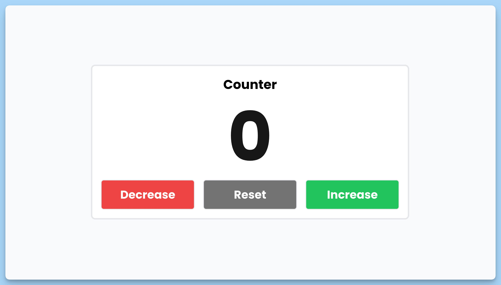

## 📦 Приложение - Счетчик

### 🚀 Обзор
Данный код представляет собой React-компонент для отображения и управления счетчиком. Вот краткое описание кода:

1. Импортируются необходимые зависимости, включая `useState` из библиотеки React.

2. Создается перечисление `CounterClassNames`, которое содержит классы стилей для различных состояний счетчика.

3. Определен функциональный React-компонент `App`, который отвечает за отображение счетчика и управление им.

4. Внутри компонента `App`:

  - Используется хук `useState` для создания состояния `counter`, которое хранит текущее значение счетчика (число).
  - Определяется переменная `className`, которая выбирает класс стилей в зависимости от значения счетчика. Если счетчик отрицателен, используется стиль для отрицательных значений; если положителен, то стиль для положительных значений; в противном случае, используется стиль для нейтральных значений.
  - Создаются обработчики событий для уменьшения, увеличения и сброса счетчика: `handleDecrease`, `handleIncrease` и `handleReset`.

5. Возвращается JSX-разметка, которая представляет интерфейс счетчика и кнопок для управления им. Счетчик отображается с использованием класса стилей `className`, который был определен ранее.

6. Компонент `App` экспортируется по уумолчанию для его дальнейшего использования в приложении.

В итоге, данный компонент позволяет отображать счетчик на веб-странице и управлять им, при этом применяя разные стили в зависимости от его значения.

---
#### 🌄 Превью:

-----
#### 🙌 Автор: [@nagoev-alim](https://github.com/nagoev-alim)

