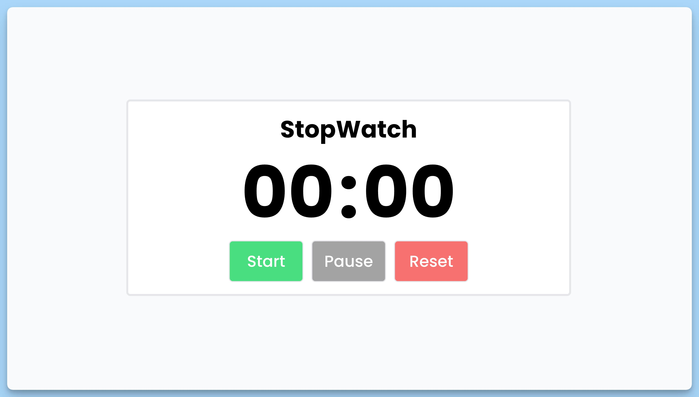

## 📦 Приложение - Секундомер

### 🚀 Обзор

Данный код представляет собой React-компонент, реализующий секундомер с возможностью запуска, приостановки и сброса времени. Вот краткое описание кода:

1. Импортируются необходимые зависимости React и useState.

2. Определён интерфейс `Timer`, который представляет собой объект с полями `counter`, `minutes` и `seconds`, описывающими текущее состояние секундомера.

3. Создан функциональный компонент `App`, который отображает и управляет секундомером.

4. В компоненте `App` созданы состояния `timer`, `timerStart` и `timerInterval` с помощью хука `useState`. `timer` содержит информацию о времени, `timerStart` - флаг, указывающий, запущен ли секундомер, а `timerInterval` - идентификатор интервала, используемого для обновления времени.

5. Реализованы три функции-обработчика событий:
  - `handleStart` запускает секундомер, если он не был запущен, и обновляет время каждую секунду.
  - `handlePause` приостанавливает секундомер и очищает интервал обновления времени.
  - `handleReset` сбрасывает секундомер, останавливает его и обнуляет время.

6. Возвращается JSX для отображения компонента, включая название "StopWatch", текущее время в формате "минуты:секунды" и кнопки "Start", "Pause" и "Reset", каждая с соответствующим обработчиком события.

7. Кнопки создаются на основе массива объектов, их свойства используются для настройки внешнего вида и обработки событий.

Этот компонент представляет собой простой секундомер с базовыми функциями управления временем.

---
#### 🌄 Превью:

-----
#### 🙌 Автор: [@nagoev-alim](https://github.com/nagoev-alim)

