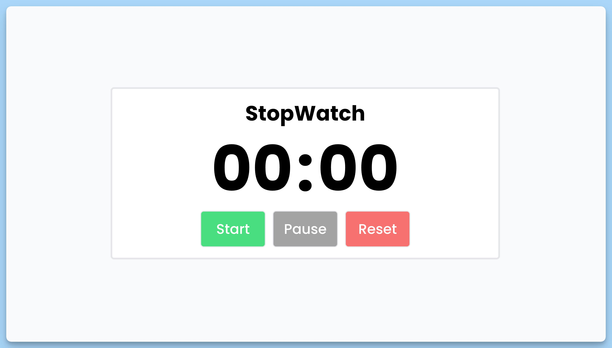

## 📦 Приложение - Секундомер

### 🚀 Обзор

Это React-приложение для управления секундомером. Оно состоит из следующих компонентов:

### App

Главный компонент приложения, отвечающий за отображение интерфейса секундомера. Он использует контекст приложения для получения данных о секундомере (`timer`) и обработчиков событий (`handleStart`, `handlePause`, `handleReset`). Интерфейс позволяет пользователю видеть текущее время на секундомере, а также запускать, приостанавливать и сбрасывать секундомер. Используются кнопки "Start", "Pause" и "Reset", а также форматирование времени для отображения минут и секунд в двузначном формате.

### AppProvider

Компонент, предоставляющий контекст приложения для дочерних компонентов. Он управляет состоянием секундомера, обработчиками событий и обновляет состояние секундомера каждую секунду с помощью `setInterval`.

### useAppContext

Хук для получения значения контекста приложения. Если используется вне компонента `AppProvider`, он вызывает ошибку.

Это приложение предоставляет удобный способ запускать, приостанавливать и сбрасывать секундомер, а также отображать текущее время на нем в удобном формате.

---
#### 🌄 Превью:

-----
#### 🙌 Автор: [@nagoev-alim](https://github.com/nagoev-alim)

