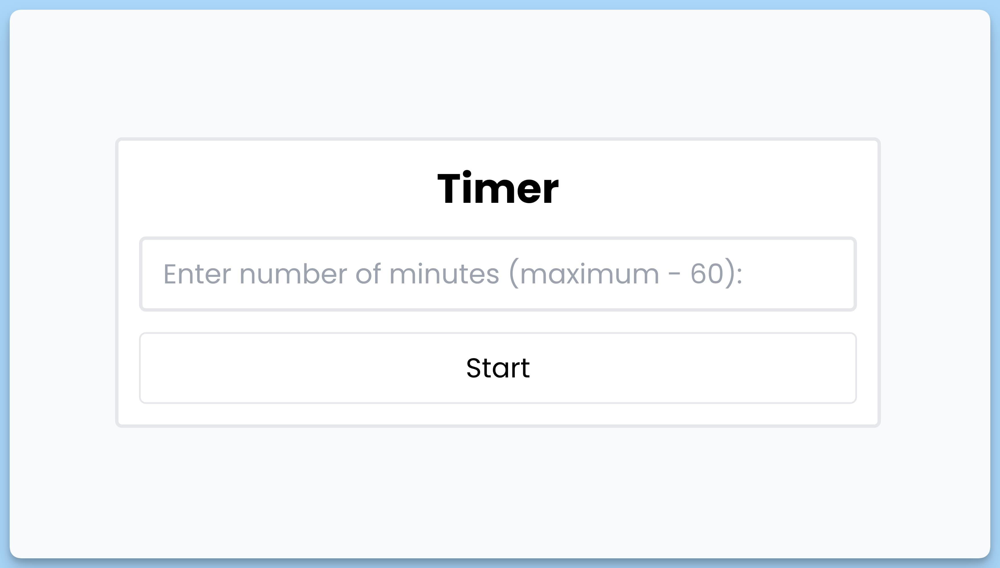
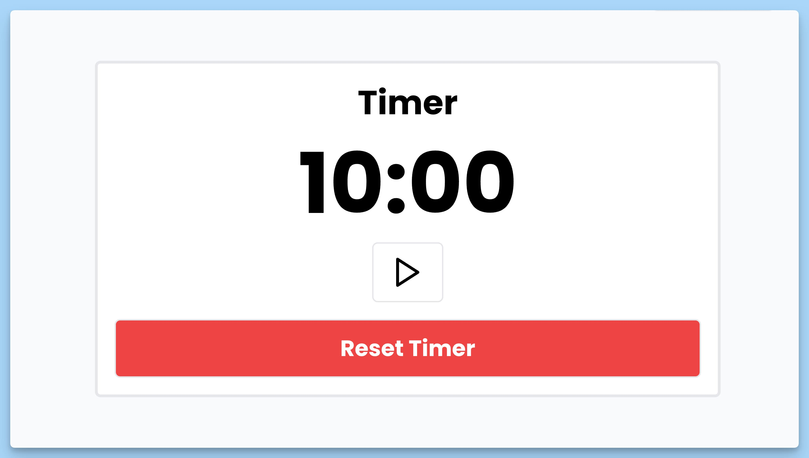

## 📦 Приложение - Таймер

### 🚀 Обзор
Данный код представляет собой реактивный веб-компонент для отображения и управления таймером. Вот краткое описание каждой части кода:

### Компонент `App`
- `App` - это компонент, отвечающий за отображение и управление таймером.
- Внутри него объявляются состояния, такие как `showForm` (флаг видимости формы ввода времени), `timer` (состояние таймера), `buttonIcon` (иконка кнопки "Пуск/Пауза") и `timerStart` (состояние таймера, запущен или приостановлен).
- Используется хук `useEffect`, чтобы обновлять отображение таймера и изменять состояние таймера в реальном времени.
- Компонент возвращает разметку, включая форму для ввода времени и отображение таймера.

### Компонент `Form`
- `Form` - это компонент, представляющий форму для ввода времени таймера.
- Он принимает свойства `setTimer` и `setShowForm` для управления состоянием таймера и видимостью формы соответственно.
- Внутри компонента есть обработчик `handleSubmit`, который срабатывает при отправке формы. Он извлекает введенное время и, если оно корректно, обновляет состояние таймера.

### Компонент `Screen`
- `Screen` - это компонент, отвечающий за отображение текущего времени на таймере и управление им.
- Он принимает свойства, такие как `timer`, `setTimer`, `timerStart`, `setTimerStart`, `buttonIcon` и `setShowForm`, для управления и отображения данных.
- Внутри компонента есть обработчики для запуска и сброса таймера, а также обработчик для нажатия на кнопку (запуск/остановка таймера).
- Компонент отображает текущее время таймера и кнопку управления.

Каждый компонент включает комментарии, описывающие его назначение и функциональность.

---
#### 🌄 Превью:

-----
#### 🙌 Автор: [@nagoev-alim](https://github.com/nagoev-alim)

