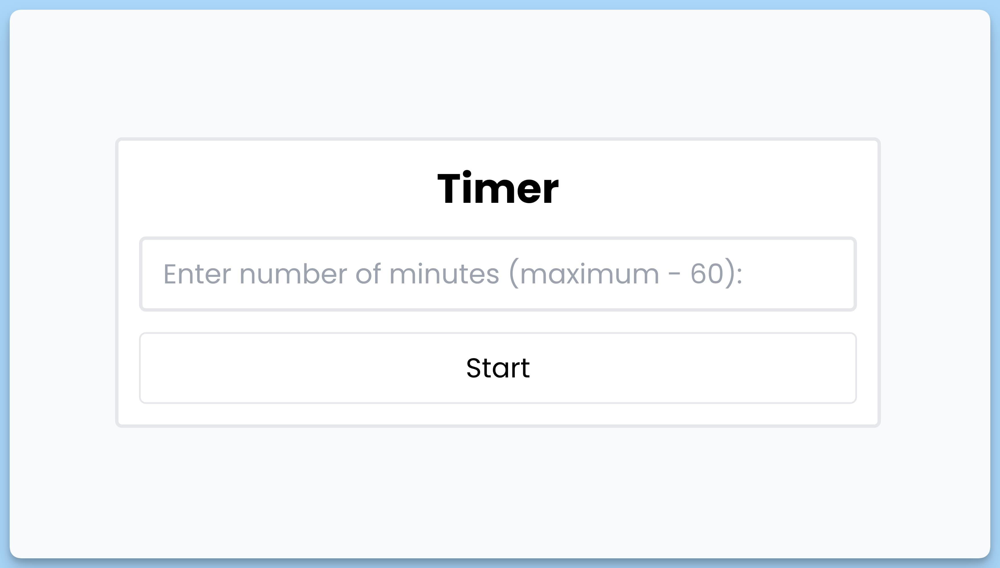
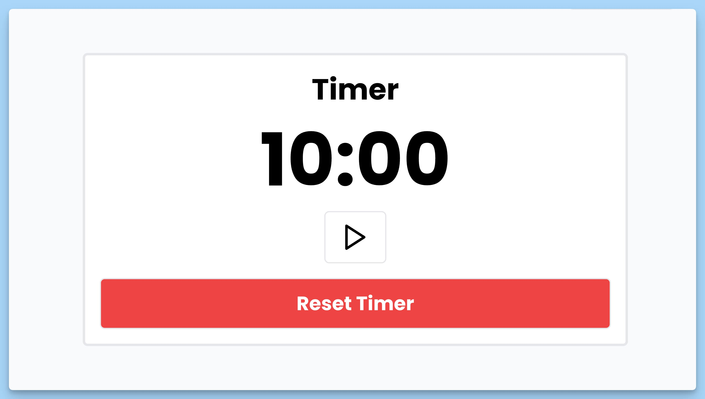

## 📦 Приложение - Таймер

### 🚀 Обзор

Это React-приложение для управления таймером. Оно состоит из следующих компонентов:

### App

Главный компонент приложения, отвечающий за отображение интерфейса таймера. Он использует контекст приложения для определения, следует ли отображать форму ввода времени. Если `showForm` истинно, то отображается компонент `Form`, иначе компонент `Screen`. Также используется `react-hot-toast` для отображения уведомлений.

### Form

Компонент формы для ввода времени таймера. Он также использует контекст приложения для доступа к функции обработки отправки формы. Пользователь может ввести количество минут для установки времени таймера. Если время меньше 60 минут, оно будет преобразовано в секунды и установлено в таймере.

### Screen

Компонент для отображения текущего времени на таймере и управления им. Он также использует контекст приложения для доступа к данным о таймере (`timer`) и обработчикам событий (`handleClick`, `buttonIcon`, `handleReset`). Пользователь может запустить, приостановить и сбросить таймер.

### AppProvider

Компонент, предоставляющий контекст приложения для дочерних компонентов. Он управляет состоянием таймера, обработчиками событий и отображением формы. Также он обновляет состояние таймера каждую секунду.

### useAppContext

Хук для получения значения контекста приложения. Если используется вне компонента `AppProvider`, он вызывает ошибку.

Это приложение предоставляет удобный способ установки и управления таймером, а также уведомляет пользователя о событиях с помощью всплывающих уведомлений.

---
#### 🌄 Превью:

-----
#### 🙌 Автор: [@nagoev-alim](https://github.com/nagoev-alim)

