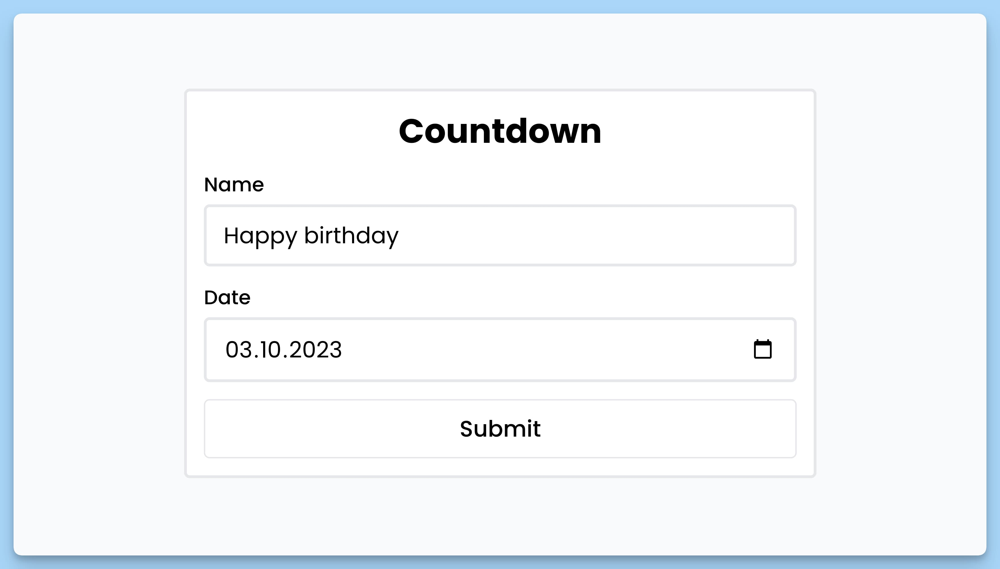
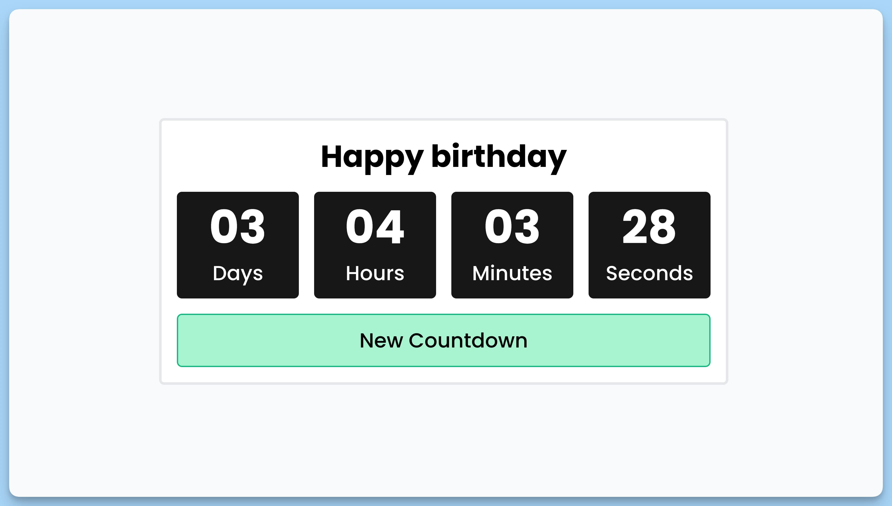
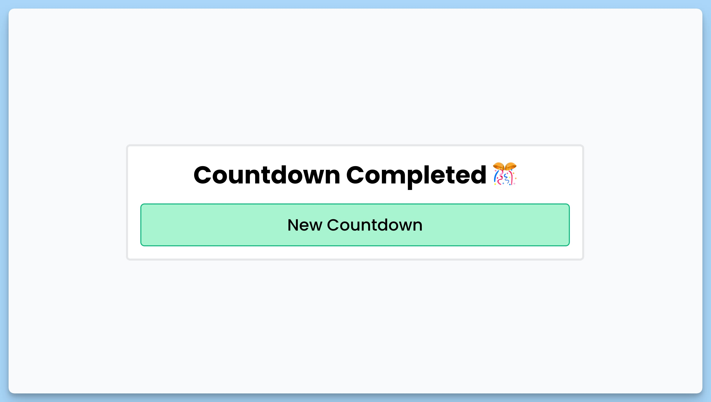

## 📦 Приложение - Таймер обратного отсчета

### 🚀 Обзор
Это приложение Countdown представляет собой компонентную реализацию таймера обратного отсчета с возможностью настройки пользователями.

### App (Компонент приложения)

Главный компонент приложения, который обеспечивает взаимодействие с другими компонентами, настройку и отображение таймера.

### Состояние

- `showForm` (boolean): Определяет, нужно ли показывать форму для настройки отсчета времени.
- `title` (string | null): Содержит заголовок отсчета времени.
- `date` (string | null): Содержит дату окончания отсчета времени.
- `endTimer` (boolean): Указывает, завершен ли таймер.

### Form (Компонент формы настройки)

Компонент формы, позволяющий пользователям настраивать параметры таймера.

### Props

- `showForm` (boolean): Флаг, указывающий, должна ли форма отображаться.
- `setShowForm` (function): Функция для установки состояния видимости формы.
- `setTitle` (function): Функция для установки заголовка отсчета времени.
- `setDate` (function): Функция для установки даты окончания отсчета времени.

### Timer (Компонент таймера)

Компонент таймера, который отображает оставшееся время в виде дней, часов, минут и секунд, а также предоставляет кнопку для создания нового отсчета.

### Props

- `showForm` (boolean): Флаг, указывающий, должна ли форма отображаться.
- `endTimer` (boolean): Указывает, завершен ли таймер.
- `setEndTimer` (function): Функция для установки состояния завершения таймера.
- `setShowForm` (function): Функция для установки состояния видимости формы.
- `setTitle` (function): Функция для установки заголовка отсчета времени.
- `date` (string | null): Содержит дату окончания отсчета времени.
- `setDate` (function): Функция для установки даты окончания отсчета времени.

### Развертывание

Приложение развертывается с использованием React и нескольких сторонних библиотек, таких как 'react-hot-toast', для улучшения интерактивности и информативности. Пользователи могут создавать собственные отсчеты времени, а результаты сохраняются в локальном хранилище браузера для последующего использования.

---
#### 🌄 Превью:

-----
#### 🙌 Автор: [@nagoev-alim](https://github.com/nagoev-alim)

