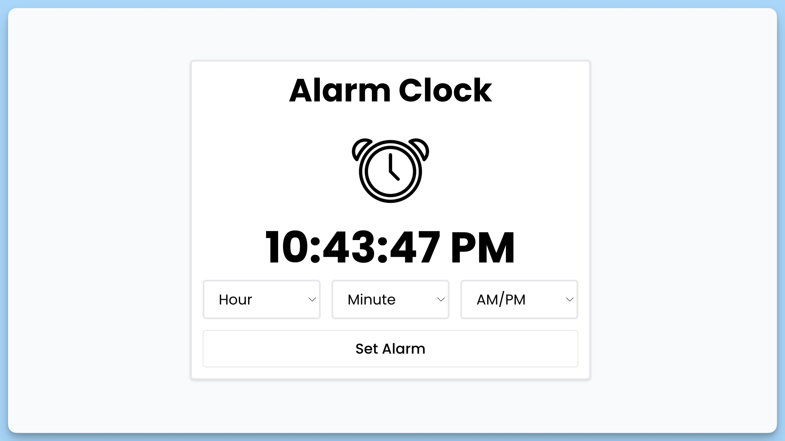

## 📦 Приложение - Будильник

### 🚀 Обзор
**Описание кода:**

Данный код представляет собой React-приложение для будильника (Alarm Clock). Вот краткое описание его основных компонентов и функций:

1. Импорт необходимых зависимостей и файлов:
  - Импортируются функция `addZero` из файла `addZero.ts`, а также звуковой файл `ringtone.mp3`.
  - Импортируются React, функциональный компонент (`FC`), хуки `useEffect`, `useState`, `useRef`, и библиотеку `react-hot-toast` для уведомлений.

2. Определение интерфейсов:
  - Определяются два интерфейса: `IAlarmSetup` и `IFormData`. Первый используется для настройки доступных часов, минут и "AM/PM", а второй для данных формы настройки будильника.

3. Главный компонент `App`:
  - Создается функциональный компонент `App` с использованием `FC`.
  - Определены состояния для отображения времени, установленного времени будильника, флага установки будильника, текста кнопки и данных формы.
  - Используются референсы для изображения будильника, корневого элемента приложения и аудио для сигнала будильника.
  - Определены настройки для выбора часов, минут и "AM/PM".
  - Используется эффект для отслеживания текущего времени и воспроизведения сигнала будильника.
  - Есть обработчики событий для изменения значения в селекторах и установки/сброса будильника.
  - Рендерится интерфейс будильника, включая изображение, текущее время, селекторы для выбора времени, кнопку "Set Alarm" и уведомления.

4. Компонент `Select`:
  - Определен функциональный компонент `Select` для отображения выпадающего списка с опциями.
  - Принимает свойства, такие как метка, имя, значение, обработчик событий и элементы данных.
  - Рендерит выпадающий список с опциями на основе переданных свойств.

5. Экспорт `App` и интерфейса `ISelectProps`.

Общий результат - это React-приложение "Alarm Clock", которое позволяет пользователю устанавливать будильник, выбирая часы, минуты и формат времени (AM/PM), и воспроизводит звуковой сигнал в установленное время.

---
#### 🌄 Превью:

-----
#### 🙌 Автор: [@nagoev-alim](https://github.com/nagoev-alim)

