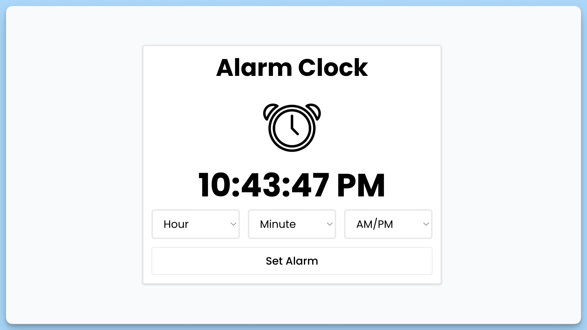

## 📦 Приложение - Будильник

### 🚀 Обзор
Данный код представляет собой главный React-компонент приложения "Alarm Clock". Краткое описание кода в формате markdown:

- Импортируются необходимые зависимости, включая компоненты, утилиты и контекст.

- Определяется функциональный компонент `App`:

  - Рендерит интерфейс будильника, включая изображение будильника, текущее время, селекторы для выбора часов, минут и "AM/PM", а также кнопку установки/сброса будильника.

  - Использует контекст приложения `useAppContext` для доступа к функциям и данным.

- Экспортируется компонент `App`.

Этот компонент представляет главный интерфейс приложения "Alarm Clock", который позволяет пользователю устанавливать будильник, выбирая часы, минуты и формат времени (AM/PM), и воспроизводит звуковой сигнал в установленное время.

---
#### 🌄 Превью:

-----
#### 🙌 Автор: [@nagoev-alim](https://github.com/nagoev-alim)

