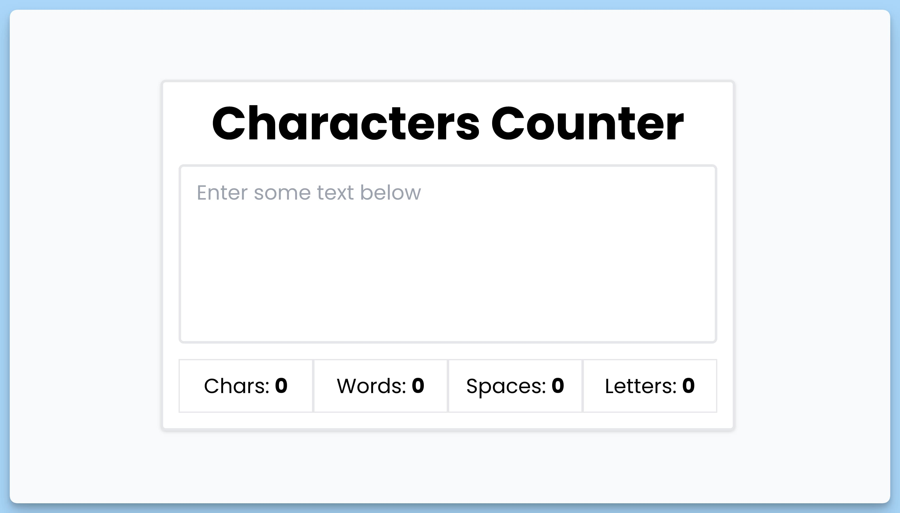

## 📦 Приложение - Подсчет символов

### 🚀 Обзор
Данный код представляет собой React-приложение "Characters Counter", которое подсчитывает различные статистические данные о тексте, введенном пользователем в поле ввода. Вот краткое описание кода:

- Создан интерфейс `State` для хранения состояния компонента, включая текст, количество символов, количество слов, количество пробелов и количество букв.

- Создан компонент `App`, который является главным компонентом приложения "Characters Counter". Он использует состояние, управляемое хуком `useState`, чтобы отслеживать изменения текста и вычислять статистические данные.

- В компоненте `App` есть обработчик `handleChange`, который вызывается при изменении текста в поле ввода (`textarea`). Обработчик вычисляет количество символов, слов, пробелов и букв в тексте и обновляет состояние компонента.

- Интерфейс `IResultProps` определяет свойства, которые передаются в компонент `Result`, включая метку (label) и значение (value) результата.

- Компонент `Result` отображает результат подсчета, используя переданные свойства `label` и `value`.

Общий результат - приложение "Characters Counter" предоставляет пользователю поле для ввода текста, а затем отображает количество символов, слов, пробелов и букв в этом тексте.

---
#### 🌄 Превью:

-----
#### 🙌 Автор: [@nagoev-alim](https://github.com/nagoev-alim)

