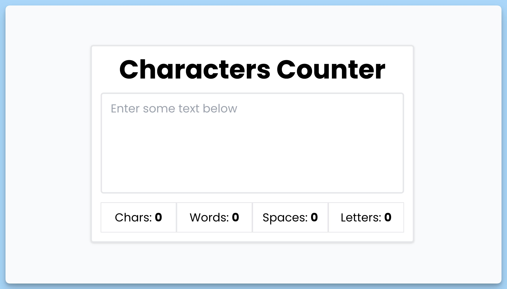

## 📦 Приложение - Подсчет символов

### 🚀 Обзор
Код представляет собой React-приложение "Characters Counter" с использованием контекста для управления состоянием. Вот краткое описание кода:

### Компонент `App`

- Это главный компонент приложения "Characters Counter".
- Он использует контекст приложения, предоставляемый через `useAppContext`, чтобы получить доступ к состоянию `charactersState` и функции `handleChange`.
- Компонент `App` отображает интерфейс с текстовым полем ввода и результатами подсчета символов, слов, пробелов и букв.
- При вводе текста в поле ввода вызывается функция `handleChange`, которая обновляет состояние `charactersState` на основе введенного текста.
- Результаты подсчета отображаются с помощью компонента `Result`.

### Контекст `AppProvider`

- Это поставщик контекста приложения.
- Он использует `useState` для создания состояния `charactersState`, которое хранит текст, количество символов, количество слов, количество пробелов и количество букв.
- Функция `handleChange` обрабатывает изменения текста в поле ввода, выполняет подсчет символов, слов, пробелов и букв, и обновляет соответствующие значения в состоянии.
- Состояние и функция `handleChange` предоставляются через контекст приложения с использованием `AppContext.Provider`.

### Компонент `Result`

- Это функциональный компонент, который отображает результаты подсчета (например, количество символов, слов и т. д.).
- Он принимает свойства `label` и `value`, чтобы отображать соответствующие метки и значения.
- Компонент `Result` используется для отображения результатов в компоненте `App`.

В итоге, приложение "Characters Counter" позволяет пользователям вводить текст и моментально видеть количество символов, слов, пробелов и букв в этом тексте.

---
#### 🌄 Превью:

-----
#### 🙌 Автор: [@nagoev-alim](https://github.com/nagoev-alim)

