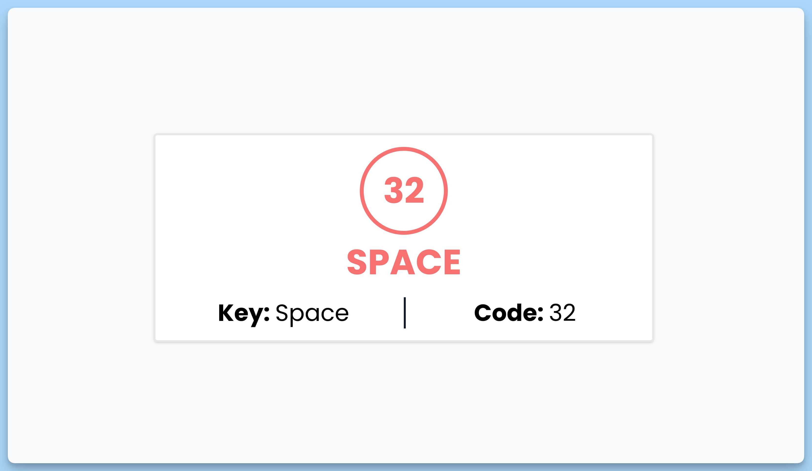

## 📦 Приложение - Детектор нажатия клавиши

### 🚀 Обзор
Данный код представляет собой React-компонент с интерфейсом, который позволяет отслеживать и отображать информацию о клавише, которую пользователь нажал на клавиатуре. Вот краткое описание его функциональности:

- Компонент `App` является главным компонентом приложения.
- Состояние `key` используется для хранения информации о нажатой клавише и её коде. Изначально оно устанавливается в `null`.
- При помощи `useEffect`, компонент добавляет обработчик события `keydown` для отслеживания нажатий клавиш, и затем, с помощью обработчика `handleKeyDown`, обновляет состояние `key` с информацией о нажатой клавише.
- Если не была нажата ни одна клавиша, отображается заголовок "Press any key".
- Если клавиша была нажата, отображается информация о нажатой клавише и её коде.

Этот компонент позволяет пользователю отслеживать нажатия клавиш на клавиатуре и отображать информацию о них в пользовательском интерфейсе.

---
#### 🌄 Превью:

-----
#### 🙌 Автор: [@nagoev-alim](https://github.com/nagoev-alim)

