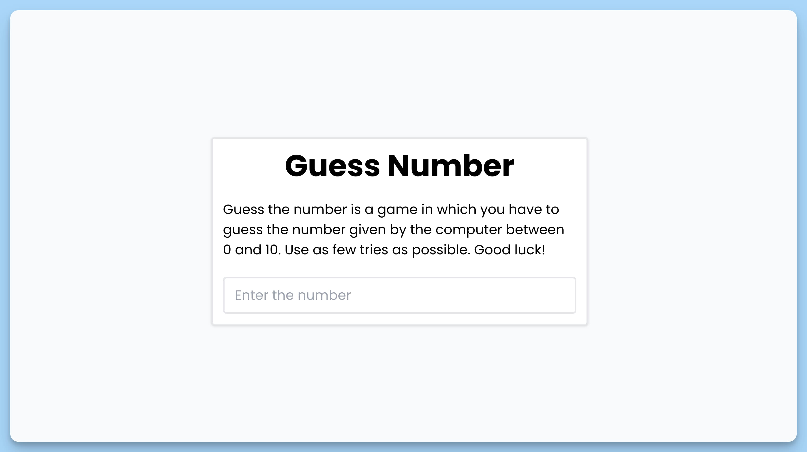

## 📦 Приложение - Угадай число

### 🚀 Обзор
Код представляет собой React-компонент приложения "Guess Number". Вот краткое описание его функциональности:

1. Создается React-компонент с именем `App`, использующий функциональный компонент (`FC`).

2. Состояние игры `game` включает информацию о секретном числе и количестве попыток.

3. Создается ссылка `inputRef` для управления элементом ввода числа.

4. При первоначальной загрузке компонента выводится в консоль секретное число для отладки.

5. Объявляется функция `handleSubmit`, которая обрабатывает событие отправки формы ввода числа.

6. Если введенное число меньше 1, больше 10 или равно 0, выводится сообщение об ошибке.

7. Если введенное число совпадает с секретным числом, выводится сообщение о победе, и выполняется анимация с конфетти.

8. Если введенное число не совпадает с секретным числом, уменьшается количество оставшихся попыток. Если осталась одна попытка, выводится сообщение о проигрыше.

9. В случае проигрыша отключается ввод числа на некоторое время, а затем восстанавливается.

10. Компонент выводит форму для ввода числа и предоставляет сообщения об успешной игре, проигрыше и оставшихся попытках.

11. Также присутствует компонент `Toaster` для отображения всплывающих уведомлений снизу по центру.

12. Весь код представляет игру "Угадай число", где игроку необходимо угадать секретное число, предложенное компьютером в диапазоне от 1 до 10.

---
#### 🌄 Превью:

-----
#### 🙌 Автор: [@nagoev-alim](https://github.com/nagoev-alim)

