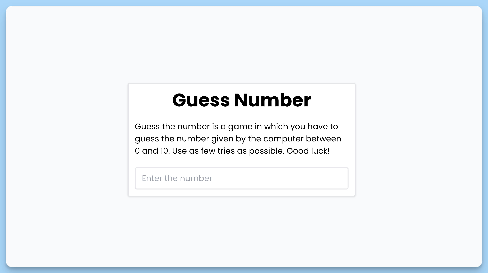

## 📦 Приложение - Угадай число

### 🚀 Обзор
Этот код представляет собой React-приложение, в котором пользователь пытается угадать секретное число между 0 и 100. Вот краткое описание его функциональности:

- Пользователю предлагается ввести свое имя.
- После ввода имени и нажатия кнопки отправки, пользователь видит поле для ввода числа.
- Пользователь вводит число, и приложение предоставляет подсказки, указывающие, больше ли введенное число или меньше секретного числа.
- Приложение также подсчитывает количество попыток и сообщает пользователю, когда он угадал число.
- После успешного угадывания числа игра завершается.
- Подсказки и результаты выводятся в виде сообщений.
- Пользователь может попробовать угадать число за наименьшее количество попыток.
- Все сообщения об ошибках и результаты выводятся с использованием библиотеки `react-hot-toast`.
- Визуальное оформление представлено в виде классов CSS.
- Приложение реализовано с использованием библиотеки React и функциональных компонентов.

Комментарии и JSDoc в коде также описывают основные моменты и функции внутри компонента для удобства понимания его работы и структуры.

---
#### 🌄 Превью:

-----
#### 🙌 Автор: [@nagoev-alim](https://github.com/nagoev-alim)

