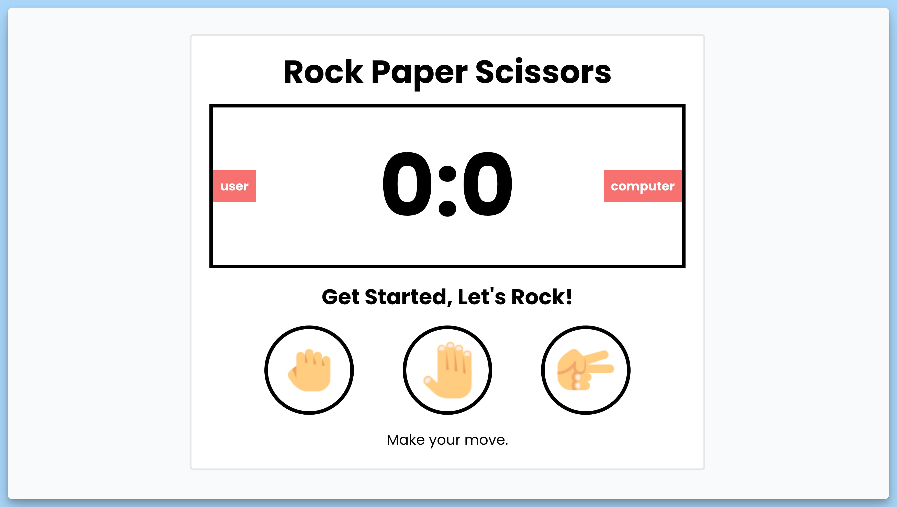

## 📦 Приложение - Камень-Ножницы-Бумага

### 🚀 Обзор
Данный код представляет собой React-приложение "Камень, ножницы, бумага". Он создает интерфейс для игры между пользователем и компьютером, где они могут выбирать между камнем, ножницами и бумагой. Вот его основные элементы:

- Загружаются изображения для камня, ножниц и бумаги.
- Состояние счета между пользователем и компьютером управляется с использованием хуков `useState`.
- Сообщение о текущем состоянии игры и окончании игры также управляется с использованием хуков `useState`.
- Существуют функции `gameMove` и `optionGame` для обработки ходов в игре, изменения счета и управления окончанием игры.
- Интерфейс включает в себя кнопки для выбора камня, ножниц или бумаги, и отображает счет между пользователем и компьютером, а также сообщения о текущем состоянии игры.
- При завершении игры можно начать заново.

Это интерактивная игра, где пользователь соревнуется с компьютером в игре "Камень, ножницы, бумага", и результаты отображаются на экране.

---
#### 🌄 Превью:

-----
#### 🙌 Автор: [@nagoev-alim](https://github.com/nagoev-alim)

