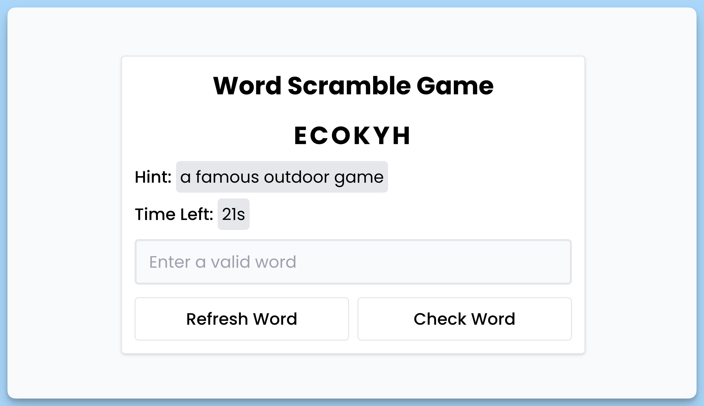

## 📦 Приложение - Игра в перемешивание слов

### 🚀 Обзор
Данный код представляет собой React-компонент, реализующий игру "Игра в перемешивание слов". Вот краткое описание кода в формате Markdown:

- Компонент `App` создан с использованием библиотеки React и представляет главную часть приложения "Игра в перемешивание слов".

- Внутри компонента используются состояния, хуки `useState` и `useEffect`, а также ссылки (`useRef`) для управления различными аспектами игры.

- Игра начинается с инициализации, которая происходит при загрузке компонента. В инициализации выбирается случайное слово из списка `mock`, перемешиваются его буквы и выводится на экран для пользователя вместе с подсказкой.

- Таймер начинает отсчет времени, и если время заканчивается, пользователю выводится сообщение о том, что время истекло, и отключается кнопка.

- Пользователь может ввести слово в поле ввода, которое проверяется на правильность. Если слово верное, пользователь получает сообщение о победе.

- Есть также кнопка "Refresh Word", которая позволяет пользователю начать новую игру, и кнопка "Check Word" для проверки введенного слова.

- По ходу игры выводится информация о текущем слове, подсказке и оставшемся времени.

- Используется библиотека `react-hot-toast` для отображения уведомлений в виде "toast" сообщений.

- Компонент оформлен с использованием CSS-стилей для создания приятного интерфейса.

Этот компонент представляет собой простую игру, где пользователь должен разгадать перемешанное слово за отведенное время.

---
#### 🌄 Превью:

-----
#### 🙌 Автор: [@nagoev-alim](https://github.com/nagoev-alim)

