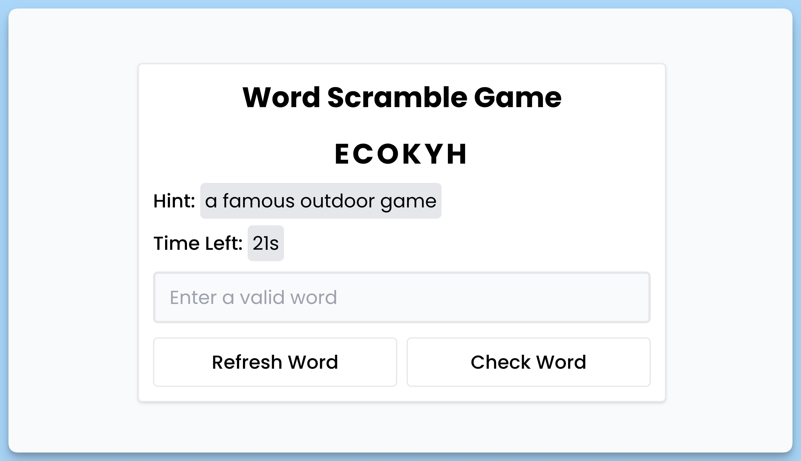

## 📦 Приложение - Игра в перемешивание слов

### 🚀 Обзор
Этот код представляет собой React-приложение "Word Scramble Game" с использованием контекста. Вот краткое описание:

- **Компонент `App`**:

  - Это главный компонент приложения, который отображает интерфейс игры "Word Scramble Game".

  - Получает данные из контекста приложения с помощью хука `useAppContext`, такие как текущее слово, подсказка, оставшееся время и функции для инициализации игры и проверки введенного слова.

  - Использует библиотеку `react-hot-toast` для отображения уведомлений.

- **Контекст приложения**:

  - Создает контекст `AppContext`, который предоставляет данные и функции для управления состоянием игры.

  - `AppProvider` - поставщик контекста приложения, который хранит состояния для слов, таймера, и других значений, а также функции для инициализации игры и проверки введенных слов.

  - Этот компонент обеспечивает доступ к данным и функциям через контекст и предоставляет их дочерним компонентам.

- **Хук `useAppContext`**:

  - Этот хук позволяет компонентам получать доступ к данным и функциям, хранящимся в контексте приложения.

  - Если хук используется вне контекста, он выбрасывает ошибку.

В итоге, код создает игру "Word Scramble Game", где пользователь должен расшифровать перемешанное слово, учитывая подсказку и ограниченное время, и использует контекст для управления состоянием игры и передачи данных и функций между компонентами.

---
#### 🌄 Превью:

-----
#### 🙌 Автор: [@nagoev-alim](https://github.com/nagoev-alim)

