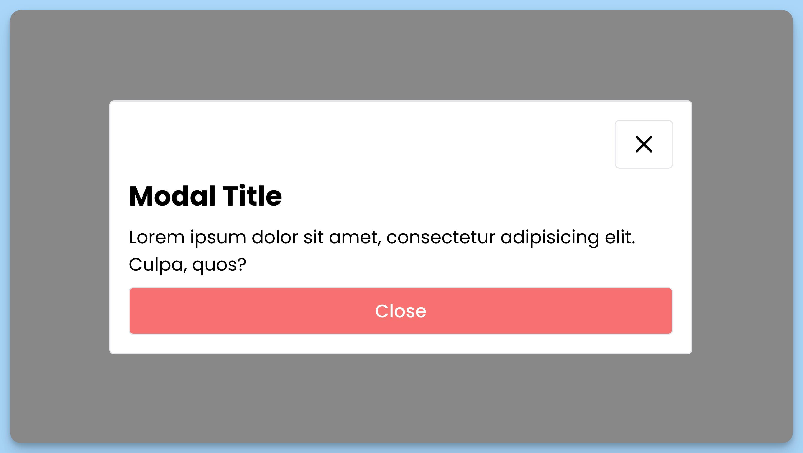

## 📦 Приложение - Модальное окно

### 🚀 Обзор
Этот код представляет собой React-приложение, состоящее из двух компонентов:

**Компонент `App`**:

- Это главный компонент приложения "Modal Window".
- Имеет кнопку "Open Modal", которая открывает модальное окно.
- Поддерживает обработку событий клавиатуры: при нажатии клавиши "Escape" модальное окно закрывается.
- Использует компонент `Modal`, передавая ему состояние `modalOpen` и функцию `toggleModal` для управления видимостью модального окна.

**Компонент `Modal`**:

- Это компонент для отображения модального окна.
- Отображает переданные дочерние элементы в модальном окне.
- Поддерживает обработку события клика за пределами модального окна для закрытия его.
- Принимает свойства `modalOpen` (флаг, указывающий, открыто ли модальное окно) и `handleClick` (функция-обработчик для закрытия модального окна).

Общее назначение этого кода - создать приложение с модальным окном, которое можно открыть и закрыть как по кнопке, так и по нажатию клавиши "Escape".

---
#### 🌄 Превью:

-----
#### 🙌 Автор: [@nagoev-alim](https://github.com/nagoev-alim)

