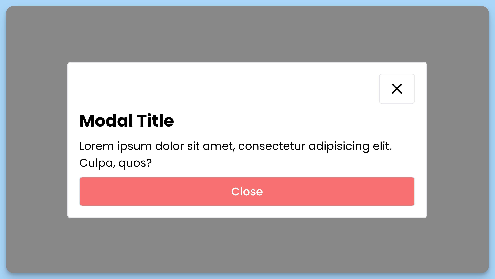

## 📦 Приложение - Модальное окно

### 🚀 Обзор

### Компонент: App

Главный компонент приложения "Modal Window".

### Описание
Этот компонент представляет главное окно приложения "Modal Window". Он содержит кнопку "Open Modal", которая открывает модальное окно, и модальное окно с заголовком "Modal Title", текстом и кнопкой "Close". При нажатии на кнопку "Close" модальное окно закрывается.

### Используемые компоненты и библиотеки
- `Modal` - компонент модального окна.
- `useAppContext` - хук для доступа к контексту приложения.

### Props компонента App
- `modalOpen` (boolean) - флаг, указывающий, открыто ли модальное окно.
- `toggleModal` (function) - функция для открытия/закрытия модального окна.

### Действия
1. При клике на кнопку "Open Modal", вызывается функция `toggleModal`, которая открывает модальное окно.
2. В модальном окне можно нажать на кнопку "Close", чтобы закрыть модальное окно.

---
#### 🌄 Превью:

-----
#### 🙌 Автор: [@nagoev-alim](https://github.com/nagoev-alim)

