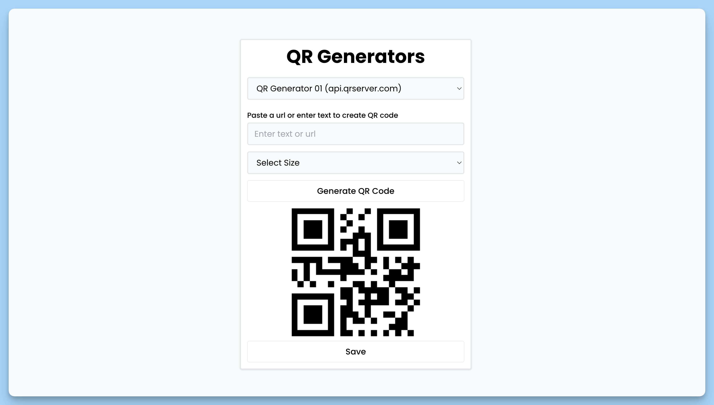

## 📦 Приложение - QR Code Генератор

### 🚀 Обзор
Код представляет собой React-приложение "QR Code Generator". Это главный компонент приложения, который позволяет пользователю выбирать разные генераторы QR-кодов и создавать QR-коды с разными параметрами.

### Функциональность

1. Пользователь видит название приложения "QR Generators" и выпадающий список для выбора типа генератора QR-кода.
2. В списке доступны разные генераторы, каждый с описанием.
3. При выборе генератора из списка отображается соответствующий компонент для создания QR-кода.
4. Пользователь может изменять параметры QR-кода, такие как текст, размер и цвет.
5. После настройки параметров, пользователь может сохранить QR-код на свое устройство.
6. При возникновении уведомлений (например, об ошибке) используется библиотека `react-hot-toast` для их отображения в нижней части экрана.

### Структура

- `App` - главный компонент приложения.
  - `selected` - состояние, хранящее выбранный тип генератора.
  - `onChange` - функция для обработки изменений в выпадающем списке.
  - `QRCodeGenerator01`, `QRCodeGenerator02`, `QRCodeGenerator03`, `QRCodeGenerator04`, `QRCodeGenerator05` - компоненты для генерации QR-кодов, которые отображаются в зависимости от выбора пользователя.
  - `Toaster` - компонент для управления уведомлениями.

Приложение предоставляет простой способ генерации QR-кодов с разными инструментами для пользователей.

---
#### 🌄 Превью:

-----
#### 🙌 Автор: [@nagoev-alim](https://github.com/nagoev-alim)

