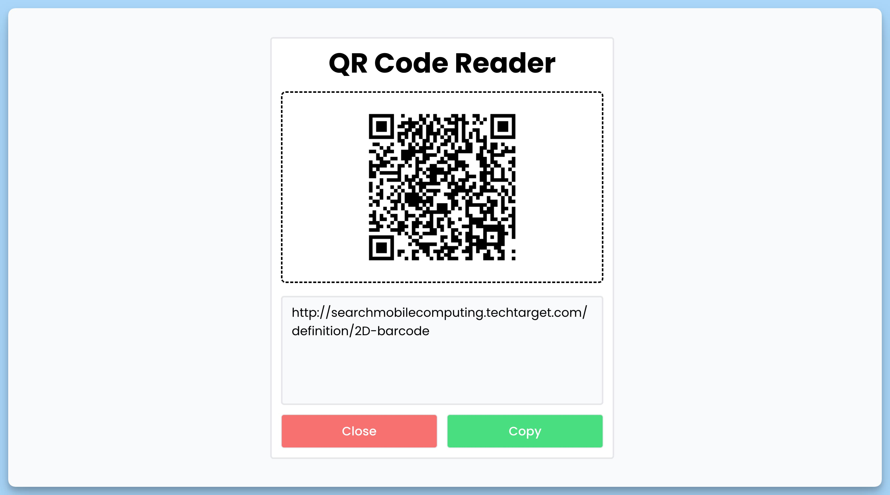

## 📦 Приложение - QR Code Reader

### 🚀 Обзор
Этот код представляет собой React-компонент с функциональным подходом, который создает веб-приложение "QR Code Reader". Он позволяет загружать изображения с QR-кодами, сканировать их, извлекать текст из QR-кода и выполнять операции копирования и сброса состояния.

### Компонент App

- **Состояния**: Компонент хранит следующие состояния:
    - `btnLabel` - текст на кнопке загрузки QR-кода.
    - `text` - текст, извлеченный из QR-кода.
    - `isLoad` - флаг, указывающий на загрузку и обработку QR-кода.

- **Обработчики событий**:
    - `handleChange(event: ChangeEvent)` - обработчик изменения выбранного файла для сканирования QR-кода.
    - `handleScanner(file: File, formData: FormData)` - сканирует QR-код с изображения.
    - `handleCopy()` - копирует текст QR-кода в буфер обмена и выводит уведомление об успешной копии.
    - `handleReset()` - сбрасывает состояние приложения после завершения сканирования.

### Описание интерфейса

- Пользователь видит заголовок "QR Code Reader" и область для загрузки изображения с QR-кодом.
- После загрузки изображения, текстовое описание и кнопка для сканирования QR-кода отображаются.
- Если QR-код успешно просканирован, текст извлекается и отображается, а также появляется кнопка "Copy" для копирования текста.
- Есть кнопка "Close" для сброса состояния.
- Используется библиотека "react-hot-toast" для уведомлений о состоянии.

Этот компонент предоставляет простой интерфейс для загрузки и сканирования QR-кодов, а также копирования текста из них.

---
#### 🌄 Превью:

-----
#### 🙌 Автор: [@nagoev-alim](https://github.com/nagoev-alim)

