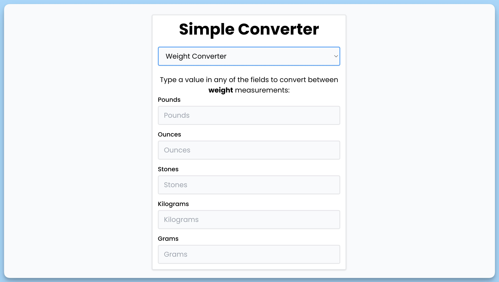

## 📦 Приложение - Конвертер величин

### 🚀 Обзор
Данный код представляет собой React-приложение, которое позволяет пользователю выбирать и использовать различные конвертеры для перевода значений между разными единицами измерения. Вот краткое описание его функциональности:

1. Подключаются необходимые зависимости, такие как React-компоненты и сторонние библиотеки.

2. Создается компонент `App`, который представляет собой главную страницу приложения.

3. Извлекается история выбора конвертера из `localStorage` и устанавливается в состояние компонента `selected`.

4. Реализован обработчик события изменения выбора конвертера в выпадающем списке (`handleChange`). В случае выбора конвертера, выбранная информация сохраняется в состоянии и `localStorage`.

5. На странице выводится заголовок и выпадающий список для выбора конвертера.

6. Если конвертер выбран, отображается блок конвертера, который зависит от выбора. Доступные конвертеры включают вес, температуру, длину, скорость и регистр текста. Компоненты для конвертации данных импортируются и рендерятся в зависимости от выбора.

В целом, приложение предоставляет пользователю возможность выбирать тип конвертера и выполнять конвертацию между различными единицами измерения.

---
#### 🌄 Превью:

-----
#### 🙌 Автор: [@nagoev-alim](https://github.com/nagoev-alim)

