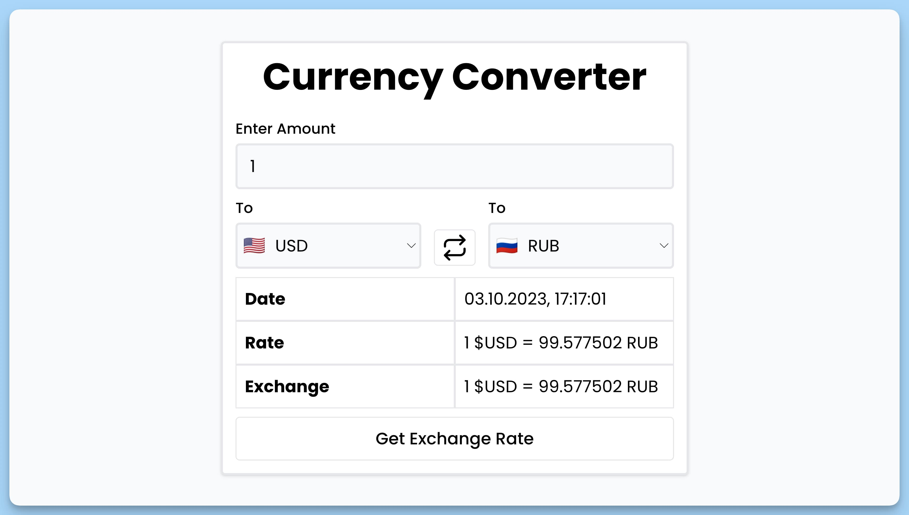

## 📦 Приложение - Конвертер валют

### 🚀 Обзор

Данный код представляет собой React-приложение для конвертации валют. Приложение включает в себя следующие функциональности:

1. Импорт необходимых зависимостей, включая React-компоненты, библиотеку для уведомлений и HTTP-клиент для запросов к API.

2. Определение интерфейса `DataCurrency`, описывающего структуру данных о конвертации валют.

3. Создание функционального React-компонента `App`, представляющего главную страницу приложения. Этот компонент включает в себя:
    - Состояния для выбранных валют, флагов загрузки и данных о конвертации.
    - Рефы для элементов формы.
    - Обработчики событий, такие как отправка формы, получение данных о конвертации, изменение валюты и обмен местами валют.

4. В компоненте `Select` создается выпадающий список для выбора валют с флагами. Этот компонент используется в форме.

5. Форма включает в себя элементы для ввода суммы, выбора валют и кнопку отправки. Также отображается анимация загрузки при выполнении запроса.

6. Получение данных о конвертации валют через API и их отображение на странице. Если при запросе возникает ошибка, выводится уведомление.

7. Присутствует возможность обмена местами валют и получения курса обмена.

8. Для уведомлений используется библиотека `react-hot-toast`.

9. Отрисовка компонента согласно полученным данным.

10. Использование локального хранилища для хранения выбора валюты пользователя.

11. Обработка событий и запросы к API выполняются асинхронно с использованием `async/await`.

12. Весь код написан с использованием современных практик и семантической разметки.

Приложение позволяет пользователям конвертировать суммы между различными валютами с возможностью выбора валют и отслеживания курсов обмена. Также оно предоставляет пользовательский опыт с использованием анимации и удобного интерфейса.

---
#### 🌄 Превью:

-----
#### 🙌 Автор: [@nagoev-alim](https://github.com/nagoev-alim)

