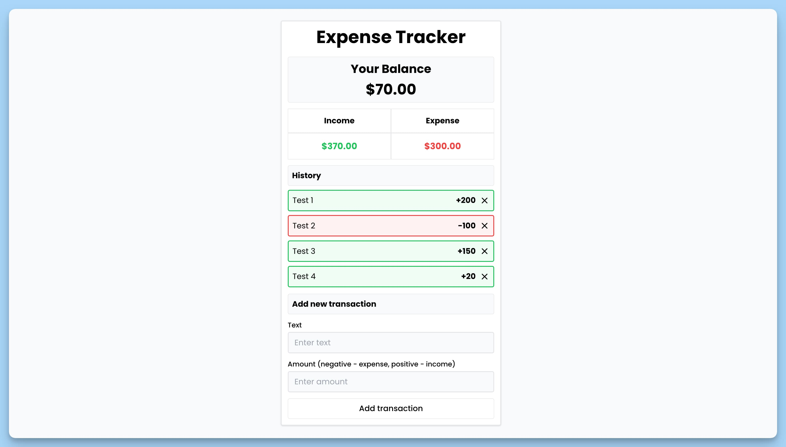

## 📦 Приложение - Учет расходов

### 🚀 Обзор

Данный код представляет собой React-приложение для учета расходов и доходов. Вот его основные особенности:

- Он импортирует несколько библиотек и компонентов, таких как `react-hot-toast`, `react-icons`, и `formatter` для форматирования чисел.
- Определяется интерфейс `Transaction`, который описывает структуру данных транзакции, включая идентификатор, описание и сумму.
- Создается компонент `App`, который представляет собой главный компонент приложения для учета расходов и доходов.

### Основные состояния:

- `transactions`: Состояние для хранения списка транзакций.
- `balance`: Состояние для хранения общего баланса.
- `income`: Состояние для хранения суммы доходов.
- `expense`: Состояние для хранения суммы расходов.

### Основные функции:

- `handleSubmit(event)`: Обработчик отправки формы для добавления новой транзакции.
- `updateBalance(data)`: Функция для обновления состояния баланса, дохода и расхода на основе данных транзакций.
- `handleDelete(itemId)`: Обработчик удаления транзакции по её идентификатору.

### Интерфейс пользователя:

- Пользователь может добавлять новые транзакции, указывая описание и сумму.
- Приложение отображает общий баланс, доход и расход.
- История транзакций выводится в виде списка с возможностью удаления записей.

---
#### 🌄 Превью:

-----
#### 🙌 Автор: [@nagoev-alim](https://github.com/nagoev-alim)

