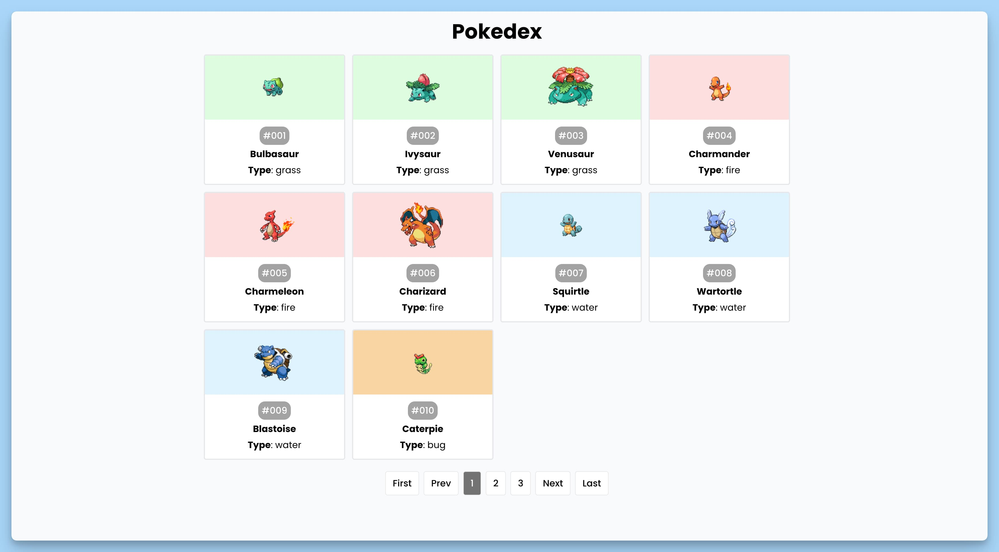
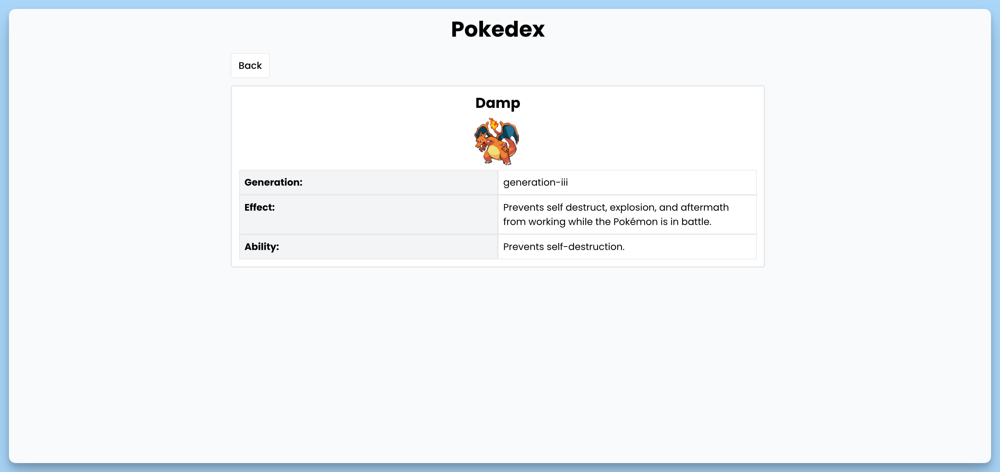

## 📦 Приложение - Pokedex

### 🚀 Обзор
### Компонент `App`
Данный код представляет собой главный компонент React-приложения с названием "Pokedex". Он выполняет следующие действия:

1. Отображает заголовок "Pokedex" в виде большого текста с использованием стилей.

2. Использует компонент "BrowserRouter" из библиотеки "react-router-dom" для настройки маршрутизации.

3. Внутри компонента "Suspense" выводит компонент "AppRoutes", который, вероятно, определяет маршруты и отображает соответствующие компоненты на основе URL-пути.

4. Использует компонент "Toaster" из библиотеки "react-hot-toast" для отображения всплывающих уведомлений в нижней части экрана.

Общая цель этого кода - создать приложение "Pokedex" с маршрутизацией, где пользователь может просматривать информацию о покемонах, и оно предоставляет заглушку "Loading..." во время загрузки данных.

### Компонент `Home Page`
Этот код представляет компонент главной страницы приложения Pokedex. Вот краткое описание того, что он делает:

1. **Импорт библиотек и констант:**
  - Импортируются необходимые зависимости, такие как `useEffect`, `useState`, `axios` и другие.
  - Импортируются константы, включая `COLORS`, `HOME_URL` и `LIMIT` из внешних модулей.

2. **Инициализация состояния:**
  - Используется хук `useState` для создания состояния `data`, `loading`, `currentPage` и `perPageCount`.
  - `data` - хранит список покемонов, инициализируется данными из локального хранилища, если они там есть.
  - `loading` - отвечает за состояние загрузки данных и инициализируется значением `false`.
  - `currentPage` - хранит текущую страницу и инициализируется значением `1`.
  - `perPageCount` - указывает, сколько элементов отображать на странице и инициализируется значением `10`.

3. **Запрос данных:**
  - В блоке `useEffect` выполняется асинхронная функция, которая загружает данные о покемонах с помощью Axios.
  - Если `data` пуст (то есть данных в локальном хранилище нет), устанавливается состояние `loading` в `true`.
  - Затем выполняется цикл для загрузки данных о покемонах в диапазоне от 1 до `LIMIT`.
  - Для каждого покемона выполняется запрос к API, и данные сохраняются в локальное состояние `data`. После каждого обновления данных, данные также сохраняются в локальное хранилище браузера.
  - После завершения загрузки данных, состояние `loading` снова устанавливается в `false`.

4. **Отображение компонентов:**
  - Возвращается фрагмент, который содержит компонент `List`, отображающий список покемонов, и компонент `Pagination`, отвечающий за пагинацию.
  - `List` отображает данные из состояния `data`, соответствующие текущей странице и количеству элементов на странице.
  - `Pagination` управляет пагинацией и позволяет переключать страницы.

Этот компонент выполняет загрузку и отображение списка покемонов с поддержкой пагинации и сохраняет данные в локальном хранилище для улучшения производительности при последующих загрузках.

### Компонент `Detail Page`
Этот код представляет компонент страницы детализации покемона в приложении. Вот краткое описание того, что он делает:

1. **Импорт библиотек и констант:**
  - Импортируются необходимые зависимости, такие как `useParams`, `useEffect`, `useState`, `axios`, `toast` и компоненты `Link` и `Ping` из внешних модулей.
  - Импортируется константа `DETAIL_URL` из внешнего модуля.

2. **Инициализация состояния:**
  - Используется хук `useParams` для извлечения параметра "id" из URL, представляющего идентификатор покемона.
  - Используется хук `useState` для создания состояния `data` и `isLoading`.
  - `data` - хранит данные о покемоне и инициализируется значением `null`.
  - `isLoading` - отвечает за состояние загрузки данных и инициализируется значением `false`.

3. **Запрос данных:**
  - В блоке `useEffect` выполняется асинхронная функция, которая загружает данные о покемоне с использованием Axios.
  - При начале запроса устанавливается состояние `isLoading` в `true`.
  - Затем выполняется запрос данных о покемоне с использованием `axios.get`, и полученные данные сохраняются в состояние `data`.
  - После завершения запроса данных устанавливается состояние `isLoading` в `false`.
  - В случае ошибки выводится уведомление `toast.error`, и ошибка также выводится в консоль для отладки.

4. **Отображение компонентов:**
  - Возвращается JSX, который отображает данные о покемоне.
  - Если `isLoading` имеет значение `true`, отображается компонент `Ping` для индикации загрузки.
  - Если данные успешно загружены, отображаются следующие элементы:
    - Кнопка "Back" с помощью `Link`, позволяющая вернуться на главную страницу.
    - Название покемона.
    - Изображение покемона, загружаемое с помощью URL.
    - Информация о покемоне, включая поколение, эффект и способности.

Этот компонент загружает и отображает подробные сведения о покемоне на основе его идентификатора и предоставляет кнопку для возврата на главную страницу.

### Компонент `Not Found Page`
Этот код представляет компонент страницы "Page Not Found" (Страница не найдена) в вашем приложении. Вот краткое описание того, что он делает:

1. **Импорт библиотек:**
  - Импортируется компонент `Link` из библиотеки `react-router-dom`.

2. **Компонент "NotFoundPage":**
  - Создается функциональный компонент "NotFoundPage".
  - Он отвечает за отображение страницы с сообщением о том, что страница не найдена.

3. **Отображение контента:**
  - Возвращается JSX-разметка для отображения следующего контента:
    - Заголовок "Page Not Found" с использованием элемента `<h1>`.
    - Кнопка "Back" с использованием компонента `Link`, которая позволяет пользователю вернуться на главную страницу.

Этот компонент предназначен для отображения пользователю страницы с сообщением о том, что запрашиваемая страница не найдена, и предоставляет возможность вернуться на главную страницу с помощью кнопки "Back".

---
#### 🌄 Превью:

-----
#### 🙌 Автор: [@nagoev-alim](https://github.com/nagoev-alim)

