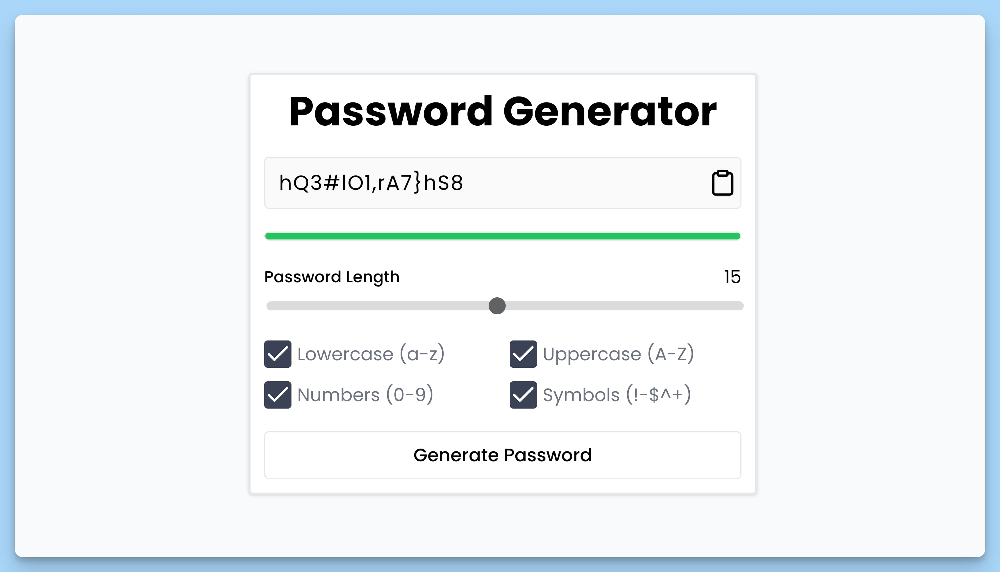

## 📦 Приложение - Генератор пароля

### 🚀 Обзор
Этот код представляет собой React-приложение, которое предоставляет возможность генерировать пароли с различными параметрами. Вот краткое описание его функциональности:

- Импортируются необходимые зависимости, такие как библиотеки React, React-компонент "Toaster" из "react-hot-toast", и другие.

- Создается функциональный компонент `App`, который представляет главное приложение "Password Generator". В этом компоненте пользователь может настроить и сгенерировать пароль.

- Внутри компонента `App` определены следующие состояния (state):
  - `pwd`: содержит сгенерированный пароль и его длину.
  - `length`: определяет длину генерируемого пароля.
  - `pwdStrong`: определяет стойкость (силу) сгенерированного пароля.

- В компоненте определены следующие функции:
  - `handleGeneratePwd()`: генерирует пароль с учетом выбранных параметров (строчные буквы, заглавные буквы, цифры, символы) и устанавливает его в состояние `pwd`.
  - `handleGeneratePassword()`: генерирует пароль на основе выбранных параметров (строчные буквы, заглавные буквы, цифры, символы) и заданной длины. Также оценивает стойкость пароля и устанавливает значение в состояние `pwdStrong`.
  - `handleCopy()`: копирует сгенерированный пароль в буфер обмена.

- JSX код компонента `App` отображает интерфейс приложения, включая настройки длины пароля, параметры генерации (строчные буквы, заглавные буквы, цифры, символы), индикатор стойкости пароля и кнопку для генерации пароля.

- Приложение также использует компонент "Toaster" для отображения уведомлений, таких как сообщение об успешном копировании пароля.

Компонент предоставляет пользователю возможность генерировать пароли с разными параметрами и отслеживать их стойкость.

---
#### 🌄 Превью:

-----
#### 🙌 Автор: [@nagoev-alim](https://github.com/nagoev-alim)

