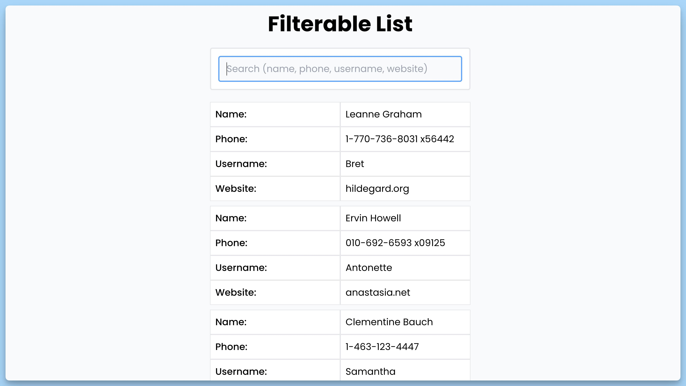

## 📦 Приложение - Фильтрация данных в таблице

### 🚀 Обзор

Код представляет собой React-приложение "Filterable List," предназначенное для отображения списка пользователей и их фильтрации по имени, телефону, имени пользователя и веб-сайту. Пользователь также может осуществлять поиск по данным. Приложение также обеспечивает сохранение списка пользователей в локальном хранилище и вывод уведомлений с использованием библиотеки `react-hot-toast`.

### Состояния

- `users`: Хранит список пользователей.
- `isLoading`: Отслеживает состояние загрузки данных.
- `query`: Строка поиска.

### Основной функционал

1. Загрузка данных о пользователях из удаленного сервера, если они отсутствуют в локальном хранилище.
2. Возможность поиска и фильтрации пользователей по имени, телефону, имени пользователя и веб-сайту.
3. Вывод загруженных пользователей в списке.
4. Вывод уведомлений в случае ошибок.

### Важные элементы кода

- Используется библиотека `react-hot-toast` для вывода уведомлений.
- Внутри `useEffect` происходит загрузка данных о пользователях при старте приложения.
- `useMemo` используется для фильтрации пользователей на основе запроса пользователя.
- Обработчик `handleChange` обновляет состояние `query` при изменении строки поиска.

### Интерфейс данных

Используется интерфейс `Data` для описания структуры данных о пользователях.

---
#### 🌄 Превью:

-----
#### 🙌 Автор: [@nagoev-alim](https://github.com/nagoev-alim)

