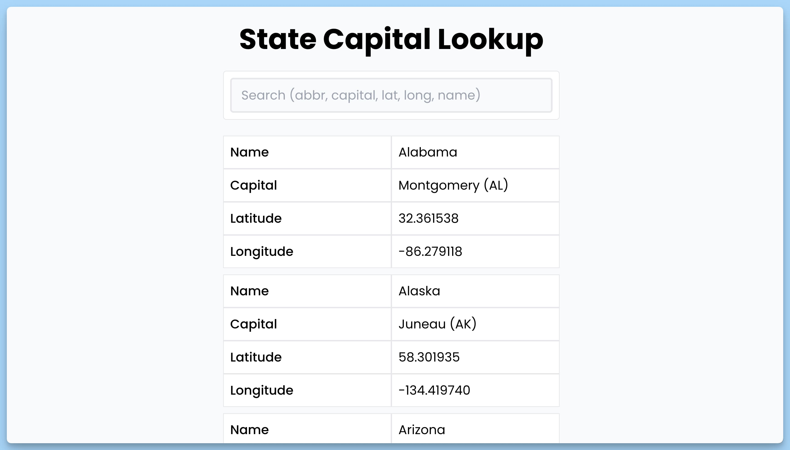
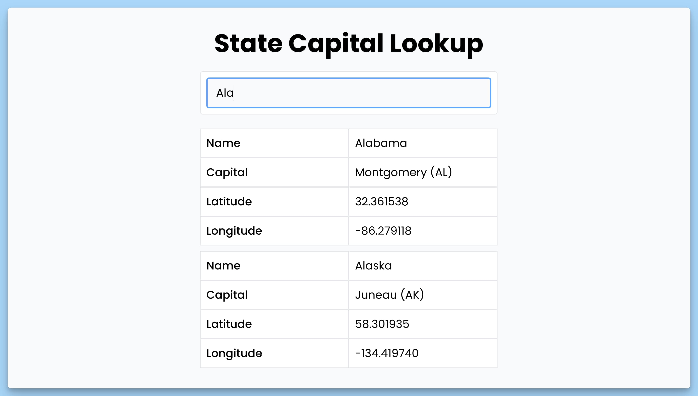

## 📦 Приложение - Поиск столицы штата

### 🚀 Обзор

Этот код представляет собой React-приложение для поиска информации о столицах штатов. Вот краткое описание его функциональности:

1. Импорт необходимых библиотек и компонентов, таких как `react-hot-toast`, `react`, и `mock.json`.

2. Определение интерфейса `State`, представляющего структуру данных о штатах с аббревиатурой, названием, столицей, широтой и долготой.

3. Создание компонента `App`, который является главным компонентом приложения "State Capital Lookup".

4. В компоненте `App` используются состояния для хранения данных о штатах, индикатора загрузки и запроса для поиска.

5. Используется `useEffect` для инициализации данных о штатах из локального хранилища, если они доступны, или из файла `mock.json`. Если что-то идет не так, выводится уведомление об ошибке.

6. Данные фильтруются на основе введенного запроса, и результат отображается в компоненте.

7. Имеется обработчик `handleChange`, который реагирует на изменения в поле ввода для запроса.

8. Затем выводится пользовательский интерфейс, включая заголовок, поле ввода для поиска, отфильтрованные данные о штатах и индикатор загрузки.

9. Используется библиотека `react-hot-toast` для отображения уведомлений.

10. Весь контент размещается внутри `div` с заданными классами для стилизации.

В итоге, этот код представляет приложение для поиска информации о столицах штатов, фильтрацию данных на основе введенного запроса и вывод результатов на экран, а также обработку ошибок при загрузке данных.

---
#### 🌄 Превью:

-----
#### 🙌 Автор: [@nagoev-alim](https://github.com/nagoev-alim)

