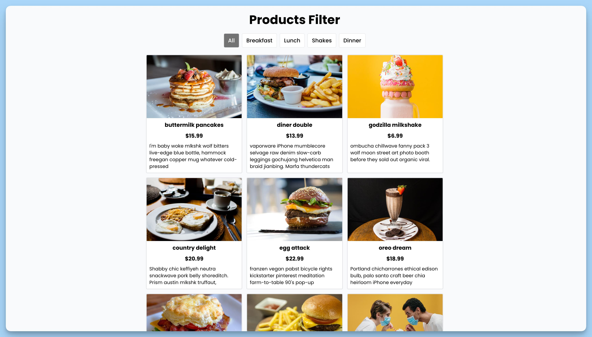

## 📦 Приложение - Фильтр продуктов

### 🚀 Обзор
Данный код представляет собой React-приложение для фильтрации и отображения продуктов. Вот краткое описание его функциональности:

- Импортируются необходимые библиотеки и модули, такие как `react-hot-toast`, `react`, и пользовательские модули `mock`, `capitalStr` и `formatter`.

- Определен интерфейс `Product` для описания структуры данных о продукте, включая его уникальный идентификатор, название, категорию, цену, ссылку на изображение и описание.

- Создан React-компонент `App`, который представляет собой главную часть приложения для фильтрации и отображения продуктов.

- Внутри компонента `App` определены состояния для хранения кнопок фильтрации, активного фильтра и списка продуктов.

- Реализована функция `handleFilter`, которая обрабатывает событие фильтрации и обновляет список продуктов в зависимости от выбранной категории.

- Верстка интерфейса включает заголовок, кнопки фильтрации, и список продуктов, которые отображаются в сетке.

- Для форматирования цены продуктов используется функция `formatter`.

- Используется библиотека `react-hot-toast` для отображения уведомлений.

- Комментарии JSDoc добавлены для документирования кода и его структуры.

Итак, данный код создает интерфейс для фильтрации и отображения продуктов с использованием React и различных вспомогательных модулей и библиотек.

---
#### 🌄 Превью:

-----
#### 🙌 Автор: [@nagoev-alim](https://github.com/nagoev-alim)

