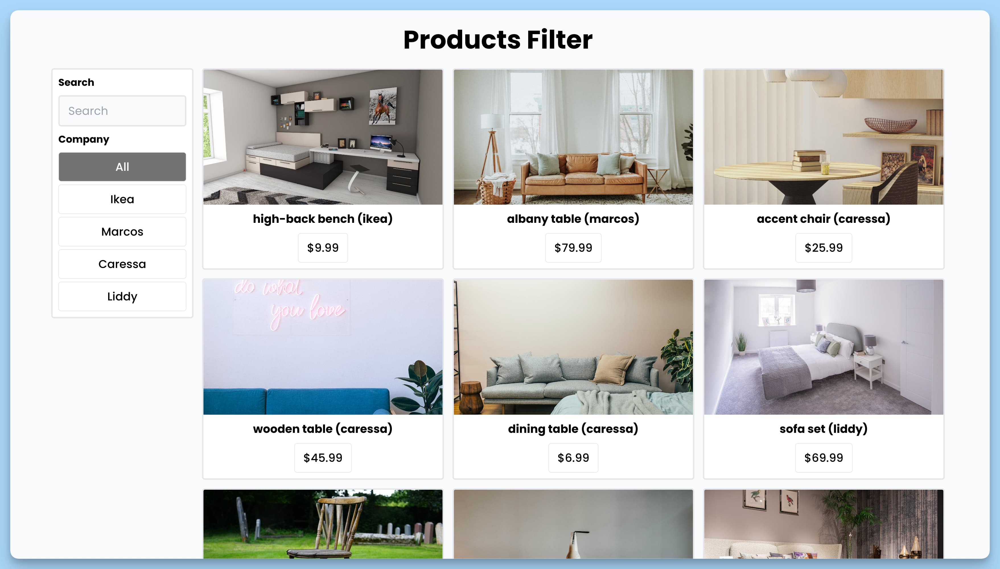

## 📦 Приложение - Фильтр продуктов

### 🚀 Обзор
Данный код представляет собой React-приложение для фильтрации и отображения списка продуктов. Вот краткое описание его функциональности:

- Импортируются необходимые библиотеки и модули, такие как `react-hot-toast`, `react`, и пользовательские модули `mock`, `formatter` и `capitalStr`.

- Определен интерфейс `Product` для описания структуры данных о продукте, включая уникальный идентификатор, название, компанию-производителя, ссылку на изображение и цену.

- Создан React-компонент `App`, который представляет собой главную часть приложения для фильтрации и отображения продуктов.

- Внутри компонента `App` определены состояния для хранения кнопок фильтрации, активного фильтра, списка продуктов и строки поиска.

- Реализована функция `handleFilter`, которая обрабатывает событие фильтрации и обновляет список продуктов в зависимости от выбранной компании-производителя.

- Реализована функция `handleChange`, которая обрабатывает событие изменения значения строки поиска и фильтрует продукты соответственно.

- Верстка интерфейса включает в себя поле ввода для поиска, кнопки фильтрации по компании-производителю и отображение списка продуктов в сетке.

- Для форматирования цены продуктов используется функция `formatter`.

- Используется библиотека `react-hot-toast` для отображения уведомлений.

- Если не найдено ни одного продукта в результате фильтрации, выводится сообщение "No products found".

Итак, данный код создает интерфейс для фильтрации и отображения продуктов с использованием React и различных вспомогательных модулей и библиотек.

---
#### 🌄 Превью:

-----
#### 🙌 Автор: [@nagoev-alim](https://github.com/nagoev-alim)

