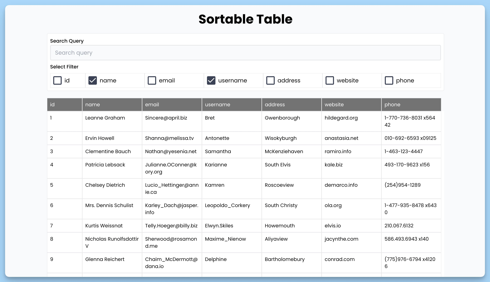
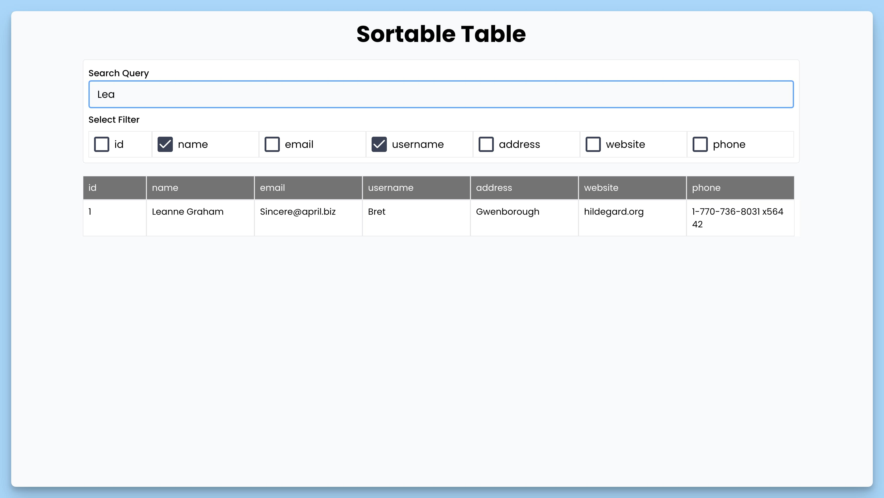

## 📦 Приложение - Сортировка данных таблицы

### 🚀 Обзор
Этот код представляет собой React-приложение, которое выполняет следующие действия:

1. Устанавливает базовый URL для запросов axios к "https://jsonplaceholder.typicode.com/users".
2. Определяет интерфейс "Data" для описания структуры данных.
3. Создает главный React-компонент "App" для отображения сортируемой таблицы.
4. Использует состояния для хранения данных, строки поиска и выбранных столбцов для поиска.
5. Загружает данные при монтировании компонента из указанного URL.
6. Определяет столбцы таблицы на основе данных.
7. Реализует функции для фильтрации строк данных по запросу, изменения строки поиска и выбранных столбцов для поиска.
8. Отображает форму поиска и отображение таблицы данных с возможностью выбора столбцов для поиска.

В результате получается веб-приложение с интерфейсом для поиска и отображения данных в таблице с возможностью выбора столбцов для поиска.

---
#### 🌄 Превью:

-----
#### 🙌 Автор: [@nagoev-alim](https://github.com/nagoev-alim)

