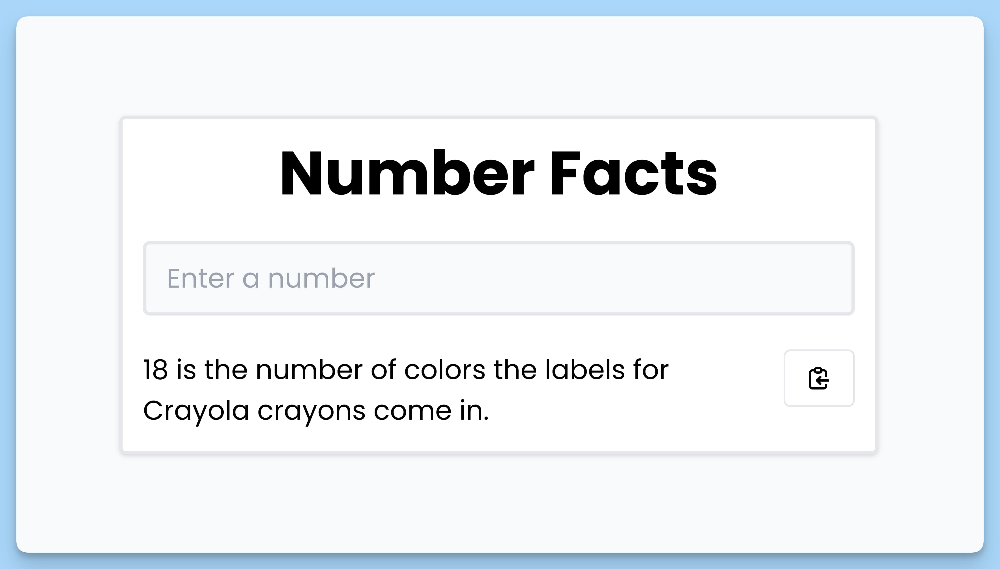

## 📦 Приложение - Факты о числах
 
### 🚀 Обзор
Код представляет собой React-приложение для получения интересных фактов о числах. Вот краткое описание:

- Приложение включает в себя форму для ввода числа.
- Когда пользователь вводит число и отправляет форму, приложение отправляет запрос к API с использованием этого числа, чтобы получить факт о числе.
- Если число равно нулю, приложение выводит сообщение об ошибке и предотвращает отправку запроса.
- Загруженные факты отображаются под формой, и пользователь может скопировать их в буфер обмена.
- Если при выполнении запроса возникли ошибки, приложение сообщает об этом и предлагает пользователю просмотреть консоль разработчика.
- Во время загрузки факта отображается анимация.
- Используется библиотека "react-hot-toast" для визуальных уведомлений.

Это простое приложение, которое демонстрирует взаимодействие с внешним API и предоставляет пользователю интересные фетчи о числах с удобным интерфейсом и уведомлениями.

---
#### 🌄 Превью:

-----
#### 🙌 Автор: [@nagoev-alim](https://github.com/nagoev-alim)

