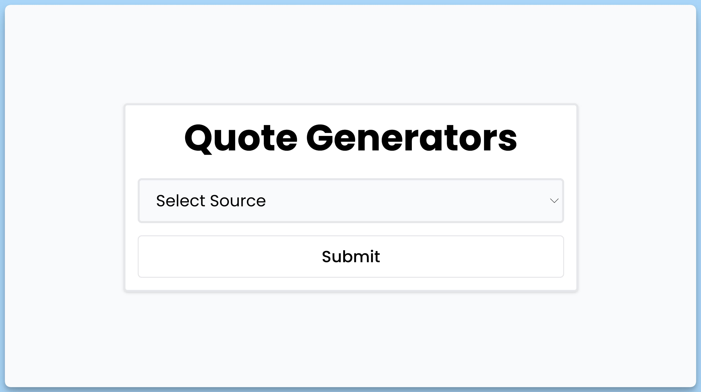
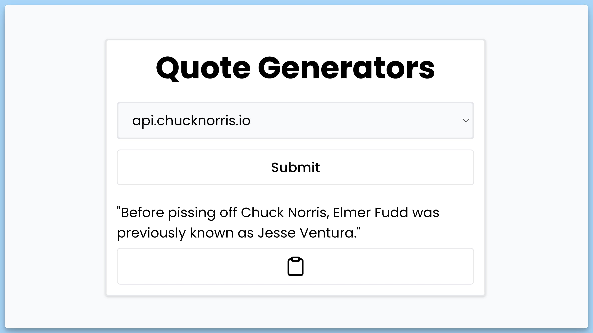

## 📦 Приложение - Генератор цитат

### 🚀 Обзор
Код представляет собой React-приложение "Quote Generators," которое позволяет пользователю получать цитаты или шутки из разных источников. Вот краткое описание кода:

- Этот код представляет собой главный компонент React-приложения "Quote Generators."
- Приложение позволяет пользователю выбирать источник цитаты из выпадающего списка и получать случайные цитаты.
- При выборе источника и отправке формы, приложение делает запрос к API и отображает полученную цитату.
- Если происходит ошибка при загрузке цитаты, приложение выводит сообщение об ошибке.
- Пользователь может скопировать цитату в буфер обмена с помощью кнопки "Copy."

Это приложение позволяет пользователям получать вдохновение и развлечение, выбирая разные источники цитат.

---
#### 🌄 Превью:

-----
#### 🙌 Автор: [@nagoev-alim](https://github.com/nagoev-alim)

