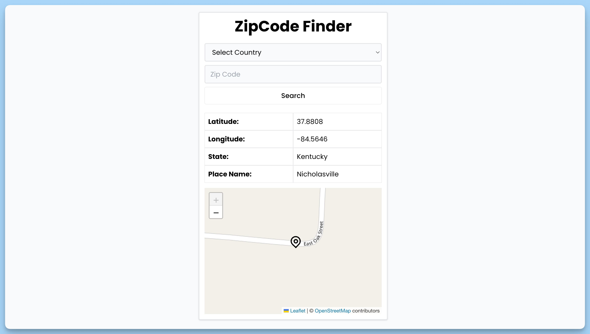

## 📦 Приложение - Поиск местоположения по ZIP-коду

### 🚀 Обзор
Данный код представляет собой React-приложение для поиска местоположения по ZIP-коду. Вот краткое описание его функциональности:

1. Импортируются необходимые библиотеки и компоненты для работы с React и визуализации данных.
2. Определен интерфейс Place для представления адреса.
3. Создан компонент App, который представляет главное приложение для поиска местоположения по ZIP-коду. Этот компонент включает в себя:
  - Состояние для хранения адреса, полученного по ZIP-коду, и состояние для отслеживания процесса загрузки данных.
  - Эффект, выполняющийся при монтировании компонента и загружающий данные по ZIP-коду из локального хранилища или использующий значения по умолчанию.
  - Функцию handleSubmit для обработки отправки формы с выбором страны и вводом ZIP-кода. В случае невалидных данных отображается сообщение об ошибке.
  - Функцию fetchData для загрузки адреса по ZIP-коду с использованием стороннего API. Если загрузка не удалась, отображается сообщение об ошибке.
  - Отображение формы для ввода ZIP-кода, индикатора загрузки, а также полученного адреса, включая координаты и маркер на карте.
4. Импортируется изображение маркера.
5. Создан компонент MarkerPosition для отображения маркера на карте. Этот компонент принимает данные о местоположении и отображает маркер на карте, который центрируется по координатам местоположения.
6. Весь компонент завершается использованием библиотеки react-leaflet для отображения карты и react-hot-toast для уведомлений.

Это приложение позволяет пользователю ввести ZIP-код и страну, а затем отображает информацию о соответствующем местоположении на карте с маркером. Если что-то идет не так, пользователю выводятся сообщения об ошибках.

---
#### 🌄 Превью:

-----
#### 🙌 Автор: [@nagoev-alim](https://github.com/nagoev-alim)

