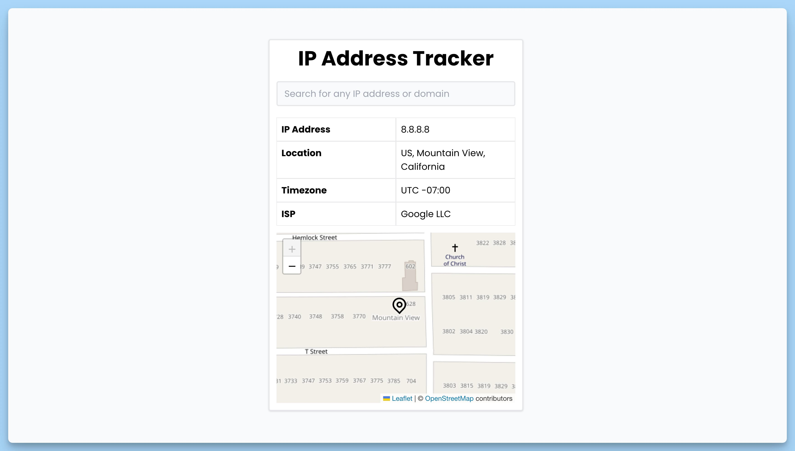

## 📦 Приложение - Поиск информации по IP-адресу

### 🚀 Обзор
Этот код представляет собой React-приложение "IP Address Tracker", которое позволяет пользователю выполнять поиск информации о местоположении и провайдере услуг Интернет по IP-адресу или домену. Вот краткое описание каждой части кода:

1. Импорт библиотек и компонентов, включая React-компоненты для отображения уведомлений и карты.

2. Объявление интерфейса Place, который описывает структуру объекта с информацией об IP-адресе.

3. Создание React-компонента App, который представляет главную часть приложения. Этот компонент включает в себя:

  - Состояния для хранения информации об IP-адресе и состояния загрузки данных.
  - Эффект, который выполняется при монтировании компонента и вызывает функцию fetchData с IP-адресом "8.8.8.8".
  - Функцию handleSubmit для обработки отправки формы поиска IP-адреса или домена.
  - Функцию fetchData для загрузки информации о местоположении и провайдере услуг Интернет по введенному IP-адресу.
  - Визуальный интерфейс с полем ввода IP-адреса, индикатором загрузки, и отображением информации о местоположении и карте.

4. Импорт компонента MarkerPosition и определение его структуры. Этот компонент предназначен для отображения маркера на карте.

5. Компонент MarkerPosition содержит:

  - Мемоизированную позицию маркера на карте.
  - Получение экземпляра карты.
  - Эффект для перемещения карты к позиции маркера.
  - Маркер и всплывающее окно на карте, отображающее местоположение IP-адреса или домена.

В целом, код создает интерфейс для поиска и отображения информации о местоположении по IP-адресу или домену с использованием библиотек React и Leaflet.

---
#### 🌄 Превью:

-----
#### 🙌 Автор: [@nagoev-alim](https://github.com/nagoev-alim)

