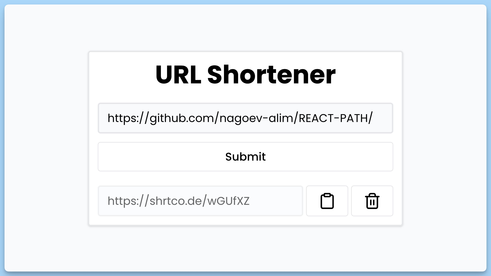

## 📦 Приложение - Сокращение URL-ссылок

### 🚀 Обзор
Данный код представляет собой веб-приложение для сокращения URL-ссылок (URL Shortener). Вот краткое описание каждой части кода:

- Импортируются необходимые библиотеки и компоненты для работы приложения.

- Создан интерфейс `Data`, представляющий структуру данных URL с полями `url` и `id`.

- Создан главный React-компонент `App`, который представляет собой основную часть приложения "URL Shortener".

- Внутри компонента `App` определены состояния `isLoading` (для отслеживания процесса загрузки) и `data` (для хранения данных URL).

- Реализован обработчик `handleSubmit` для отправки формы с URL-ссылкой. Валидируется введенный URL, сокращается через API, и результат сохраняется в состоянии `data`.

- Реализованы функции `handleCopy` для копирования URL в буфер обмена и `handleDelete` для удаления URL из списка.

- Верстка формы, отображения данных и обработчиков событий реализована с использованием HTML и CSS-классов.

- Используются библиотеки для отображения анимаций загрузки (`Ping`) и иконок (`FiClipboard`, `FiTrash2`).

- Нижнее информационное сообщение и всплывающие уведомления (toast) также поддерживаются при помощи `react-hot-toast`.

Это веб-приложение позволяет пользователю ввести URL-ссылку, сократить её и управлять сохраненными сокращенными URL.

---
#### 🌄 Превью:

-----
#### 🙌 Автор: [@nagoev-alim](https://github.com/nagoev-alim)

