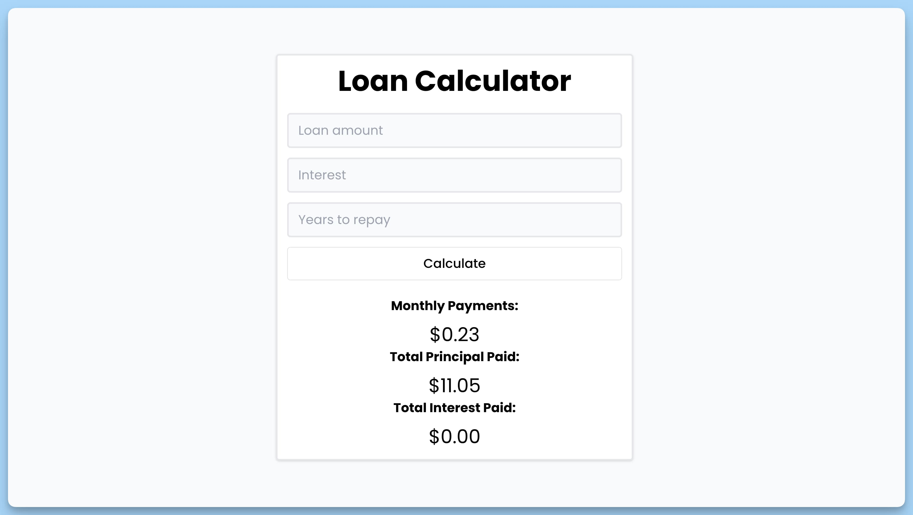

## 📦 Приложение - Кредитный Калькулятор

### 🚀 Обзор
Данный код представляет собой React-компонент "Кредитный Калькулятор". Краткое описание его функциональности:

1. Импортируются необходимые библиотеки и компоненты, такие как `react-hot-toast`, `LineWobble` и другие.
2. Определяется интерфейс `Data` для представления данных о кредите.
3. Создается React-компонент `App`, который представляет главную часть приложения.
4. В компоненте определяются состояния `data` и `isLoading` для хранения данных о кредите и отслеживания состояния загрузки.
5. Создается функция `handleSubmit` для обработки отправки формы и расчета параметров кредита.
6. Визуально отображается форма с полями для ввода суммы кредита, процентной ставки и срока погашения.
7. Если введены некорректные данные, выводится сообщение об ошибке с использованием библиотеки `toast`.
8. Во время обработки данных отображается анимация загрузки.
9. После расчета кредита отображаются результаты, включая ежемесячные платежи, сумму основного долга и сумму уплаченных процентов.
10. Все числовые значения форматируются с использованием `formatter`.
11. Внизу компонента размещена панель уведомлений `Toaster`.

Компонент "Кредитный Калькулятор" позволяет пользователям вводить данные о кредите и получать расчет по ежемесячным платежам, сумме основного долга и уплаченных процентах.

---
#### 🌄 Превью:

-----
#### 🙌 Автор: [@nagoev-alim](https://github.com/nagoev-alim)

