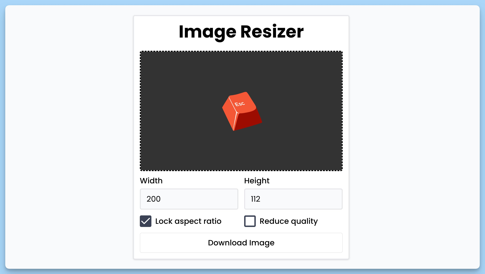

## 📦 Приложение - Редактор размера изображения

### 🚀 Обзор
В этом коде создается React-компонент с именем "App", который представляет главное окно приложения "Image Resizer". Этот компонент позволяет пользователям загружать изображения, изменять их размеры, блокировать/разблокировать соотношение сторон и управлять качеством изображения перед скачиванием.

Краткое описание ключевых элементов кода:

- Компонент "App" представляет собой главное окно приложения.
- Внутри компонента определены состояния (state), которые отслеживают ширину, высоту, блокировку соотношения сторон, уменьшение качества, загрузку, соотношение сторон изображения и метку кнопки скачивания.
- Есть ссылки на элементы изображения и ввода файла, которые используются для взаимодействия с DOM.
- В компоненте реализованы обработчики событий для изменения входного файла изображения, скачивания изображения, изменения ширины, высоты, блокировки соотношения сторон и уменьшения качества изображения.
- Внутри JSX-разметки создан интерфейс, позволяющий загружать изображения, настраивать параметры и скачивать отредактированные изображения.
- Используется библиотека "react-hot-toast" для отображения уведомлений.

Этот компонент предназначен для создания интерфейса для изменения размеров и качества изображений перед их скачиванием.

---
#### 🌄 Превью:

-----
#### 🙌 Автор: [@nagoev-alim](https://github.com/nagoev-alim)

