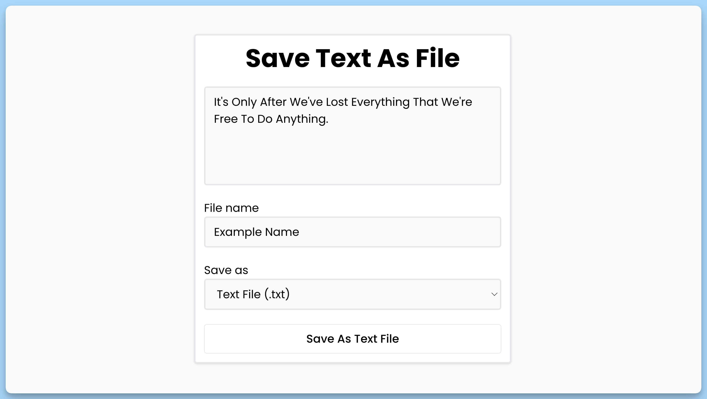

## 📦 Приложение - Сохранить текст как файл

### 🚀 Обзор
Этот код представляет собой React-компонент приложения "Сохранить текст как файл". Компонент позволяет пользователю ввести текст, выбрать тип файла, указать имя файла и сохранить его как файл на локальном компьютере.

Основные элементы кода:

- Создается массив `mock`, который содержит варианты файлов для выбора, каждый включает в себя значение и метку для отображения.

- В компоненте определены состояния для отслеживания выбранного типа файла, метки для кнопки, введенного текста и имени файла.

- Реализованы обработчики событий:
  - `handleSelect` обрабатывает изменение выбора типа файла.
  - `handleSubmit` сохраняет введенный текст как файл, если указано имя файла.
  - `handleText` отслеживает изменения в текстовом поле.
  - `handleName` отслеживает изменения в поле имени файла.

- JSX-разметка предоставляет пользователю интерфейс для ввода текста, указания имени файла, выбора типа файла и выполнения сохранения.

- Используется библиотека `react-hot-toast` для отображения уведомлений.

Когда пользователь вводит текст, выбирает тип и имя файла, а затем нажимает кнопку "Сохранить", введенный текст сохраняется как файл с выбранным типом и именем на локальном компьютере.

---
#### 🌄 Превью:

-----
#### 🙌 Автор: [@nagoev-alim](https://github.com/nagoev-alim)

