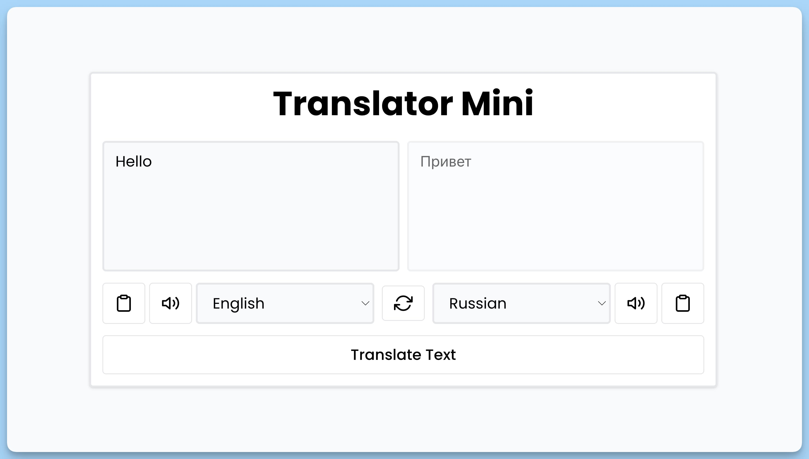

## 📦 Приложение - Переводчик

### 🚀 Обзор

Код представляет собой React-приложение "Translator Mini", которое позволяет вводить текст на одном языке и переводить его на другой язык. Ниже краткое описание его функциональности:

1. **Импорт библиотек и компонентов**:
  - Импорт необходимых библиотек, компонентов и стилей.

2. **Определение состояний**:
  - Используется `useState` для хранения различных состояний, таких как введенный текст, переведенный текст и выбранные языки.

3. **Функция `handleTranslate`**:
  - Выполняет перевод текста с одного языка на другой, используя API для машинного перевода.
  - Отображает "Loading..." во время выполнения перевода.
  - В случае ошибки выводит сообщение об ошибке и записывает информацию в консоль.

4. **Функция `handleSwitch`**:
  - Переключает исходный и переведенный текст, а также выбранные языки.

5. **Функция `handleCopy`**:
  - Копирует текст в буфер обмена и отображает сообщение об успешном копировании.

6. **Функция `handleSpeech`**:
  - Позволяет произносить текст с помощью синтеза речи, используя выбранный язык.

7. **Функции `handleSetTextFrom`, `handleSetSelectFrom`, `handleSetSelectTo`**:
  - Обрабатывают изменения вводимого текста и выбранных языков, обновляя соответствующие состояния.

8. **Визуальный интерфейс**:
  - Отображает интерфейс с двумя текстовыми полями для ввода и отображения текста, кнопками для копирования и произношения текста, а также элементами выбора языка.
  - Позволяет переключать языки между исходным и переводным текстом.
  - Предоставляет кнопку "Перевести текст" для запуска процесса перевода.
  - Использует компонент `Toaster` для отображения уведомлений.

Этот компонент обеспечивает возможность ввода, перевода, копирования и произношения текста на разных языках с помощью простого интерфейса.

---
#### 🌄 Превью:

-----
#### 🙌 Автор: [@nagoev-alim](https://github.com/nagoev-alim)

