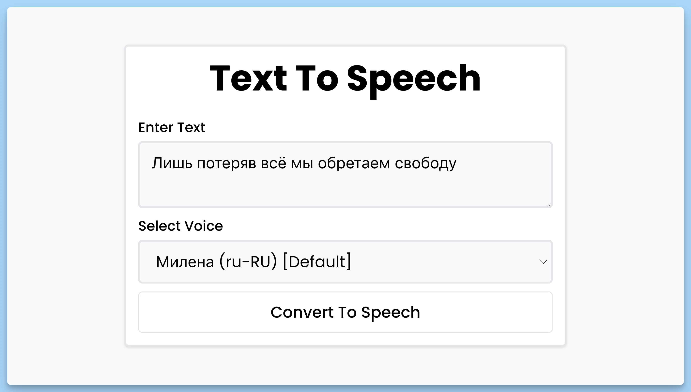

## 📦 Приложение - Text To Speech

### 🚀 Обзор
Данный код представляет собой React-приложение "Text To Speech", которое предоставляет интерфейс для преобразования введенного текста в речь. Краткое описание кода:

- Он создает React-компонент "App", который содержит форму для ввода текста и выбора голоса для синтеза речи.
- Если браузер не поддерживает синтез речи, он отображает сообщение об ошибке.
- Пользователь вводит текст в текстовое поле и выбирает голос из доступных вариантов.
- При отправке формы, текст синтезируется в речь с выбранным голосом, и речь воспроизводится.
- Если введенный текст длиннее 80 символов, кнопка "Convert To Speech" становится кнопкой "Pause Speech" для приостановки речи, и "Resume Speech" для возобновления.
- Есть компонент "VoiceSelector", который позволяет выбирать доступные голоса и управлять выбранным голосом.
- Используется библиотека "react-hot-toast" для отображения уведомлений.

В целом, код позволяет пользователям конвертировать текст в речь с возможностью выбора голоса и управления воспроизведением.

---
#### 🌄 Превью:

-----
#### 🙌 Автор: [@nagoev-alim](https://github.com/nagoev-alim)

