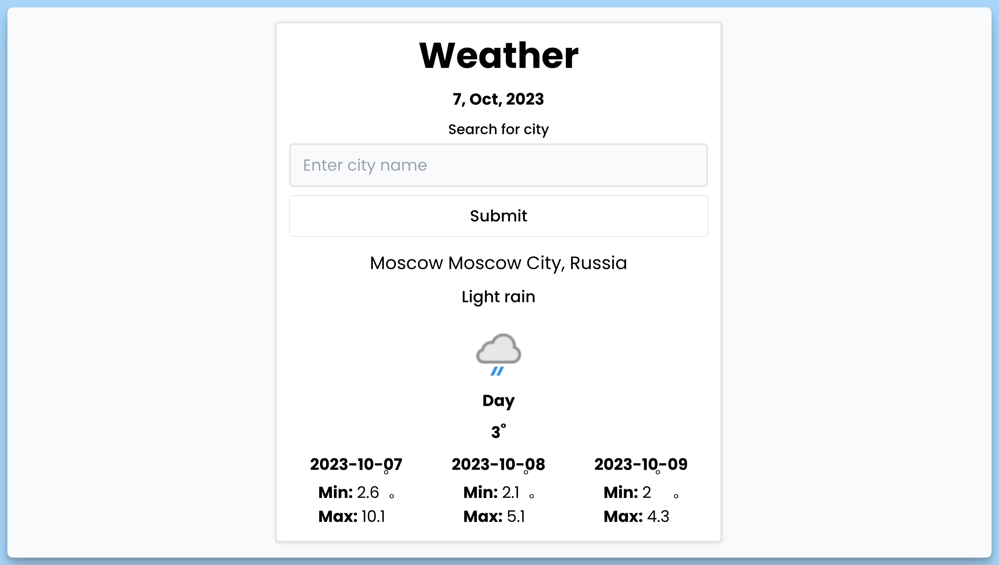

## 📦 Приложение - Прогноз погоды

### 🚀 Обзор
Этот код представляет собой React-приложение, которое предоставляет информацию о погоде для указанного города. Вот краткое описание его функциональности:

- Пользователь может ввести название города и отправить запрос.
- Запрос обрабатывается асинхронно с использованием библиотеки Axios для получения информации о погоде.
- Полученные данные отображаются в интерфейсе, включая текущую температуру, описание погоды, иконку, регион и страну.
- Также отображается прогноз на несколько дней с минимальными и максимальными температурами для каждого дня.
- Если поле запроса пустое, выводится сообщение об ошибке.
- Если происходит ошибка при запросе к API погоды, выводится сообщение об ошибке.
- Показывается индикатор загрузки во время выполнения запроса.
- Данные о городе сохраняются в локальном хранилище для последующих запросов.

Это полезное React-приложение для получения актуальной информации о погоде для выбранного города.

---
#### 🌄 Превью:

-----
#### 🙌 Автор: [@nagoev-alim](https://github.com/nagoev-alim)

