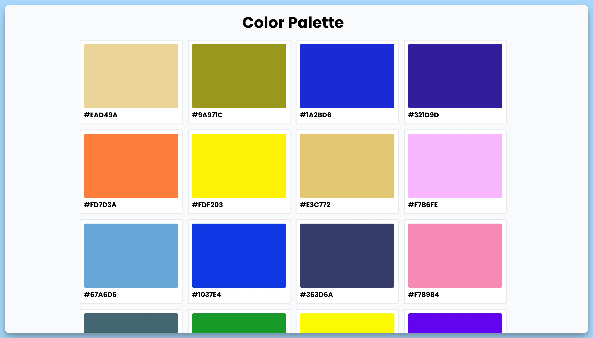

## 📦 Приложение - Палитра цветов

### 🚀 Обзор
Этот код представляет собой React-компонент с именем "App", который создает и отображает цветовую палитру. Вот краткое описание его функциональности:

- При загрузке компонента создается начальная палитра, содержащая случайные цвета.
- Пользователь может нажать на цвет в палитре, и его код цвета будет скопирован в буфер обмена.
- Есть кнопка "Refresh Palette", которая пересоздает случайную палитру цветов.
- Используется библиотека `react-hot-toast` для отображения всплывающих уведомлений, например, об успешном копировании цвета.
- Компонент состоит из заголовка, списка цветов и кнопки для обновления палитры.

Этот компонент создает интерфейс для генерации и копирования цветов, что может быть полезно для работы с цветовой палитрой в веб-приложении.

---
#### 🌄 Превью:

-----
#### 🙌 Автор: [@nagoev-alim](https://github.com/nagoev-alim)

