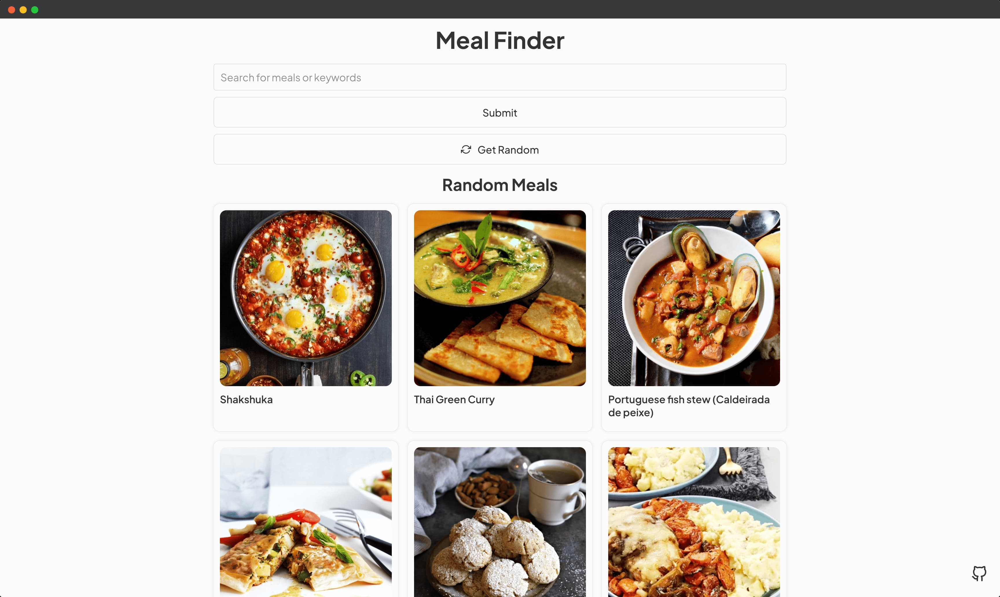
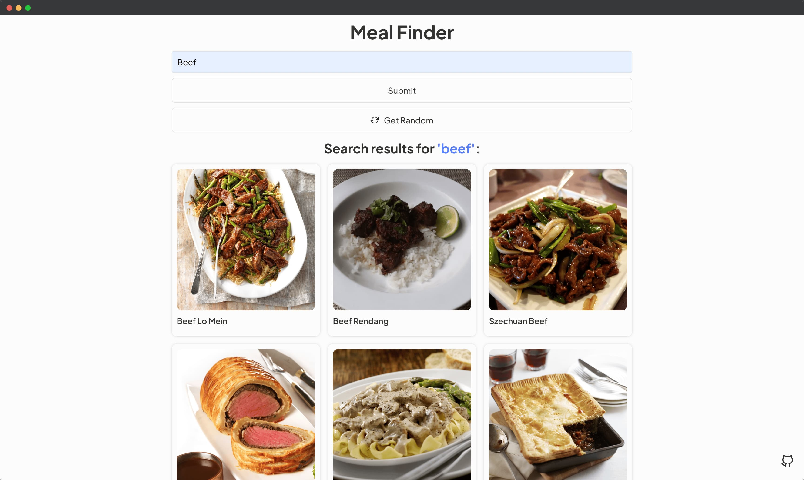
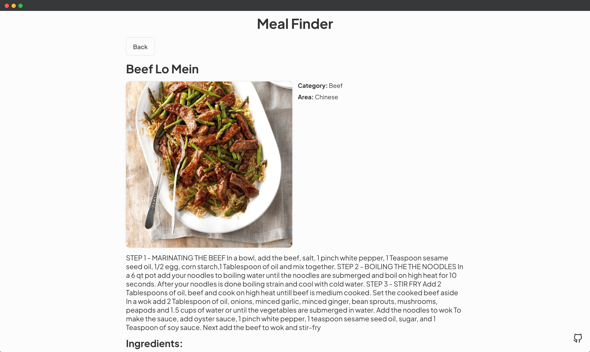

### 📦 Meal Finder App

Search and generate random meals from the [www.themealdb.com](https://www.themealdb.com) API.

- Display UI with form to search and button to generate
- Connect to API and get meals
- Display meals in DOM with image and hover effect
- Click on meal and see the details
- Click on generate button and fetch & display a random meal
---

#### 🌄 Preview:

-----

#### 💻 Stack:

- [React](https://ru.reactjs.org/)

#### 💻 API:

- [themealdb.com](https://www.themealdb.com)

-----
#### 🙌 Author: [@nagoev-alim](https://github.com/nagoev-alim)
