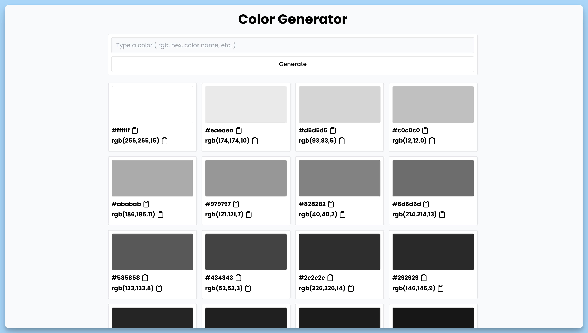

## 📦 Приложение - Палитра цветов

### 🚀 Обзор
Данный код представляет собой React-компонент "App" для создания и отображения цветовой палитры. Вот краткое описание его функциональности:

- Пользователь может вводить цвет в различных форматах (например, RGB, HEX или название цвета).
- По нажатию кнопки "Generate", введенный цвет обрабатывается и создается палитра из 10 оттенков этого цвета.
- Каждый оттенок цвета отображается как прямоугольник с цветовой заполненностью и значением HEX и RGB.
- Пользователь может нажать на значение HEX или RGB, чтобы скопировать соответствующее значение в буфер обмена.
- При успешном копировании отображается сообщение об успешной копии.
- Если введен некорректный цвет или произошла ошибка, отображается сообщение об ошибке.
- Компонент также обеспечивает визуальное представление с использованием стилей и отображается в центре экрана.
- Для уведомлений и отображения сообщений об ошибках используется библиотека `react-hot-toast`.

Этот компонент полезен для генерации и исследования различных цветовых палитр и отображения их значений.

---
#### 🌄 Превью:

-----
#### 🙌 Автор: [@nagoev-alim](https://github.com/nagoev-alim)

