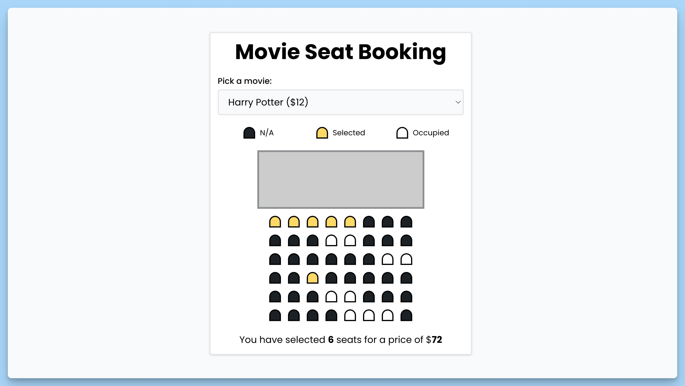

## 📦 Приложение - Бронирования мест в кинотеатре

### 🚀 Обзор

Этот код представляет собой React-компонент приложения для бронирования мест в кинотеатре. Вот краткое описание каждой части кода:

### Главный Компонент App

- `mock` - состояние, которое хранит список фильмов.
- `selected` - состояние, которое отслеживает выбранный фильм.
- `ticketPrice` - состояние, которое отслеживает цену билета для выбранного фильма.
- `totalPrice` - состояние, которое отслеживает общую цену выбранных билетов.
- `totalPicked` - состояние, которое отслеживает общее количество выбранных билетов.
- `useEffect` - эффект, выполняющийся при монтировании компонента, инициализирует данные и обновляет выбранные места.

### Функции

- `handleStorageGetData` - функция для получения данных из хранилища и обновления выбранных мест.
- `handleUpdateSelected` - функция для обновления выбранных мест и их сохранения в хранилище.
- `handleSeatClick` - обработчик клика по месту, обновляет выбранные места.
- `handleChange` - обработчик изменения выбранного фильма, обновляет цену билетов и сохраняет выбор в хранилище.

### JSX

Возвращаемый JSX содержит интерфейс для выбора фильма, отображение мест в зале, итоговую информацию о выборе и Toast-уведомления для пользователя.

Этот компонент позволяет пользователям выбирать фильмы и места в кинозале и отслеживать общую стоимость выбора.

---
#### 🌄 Превью:

-----
#### 🙌 Автор: [@nagoev-alim](https://github.com/nagoev-alim)

