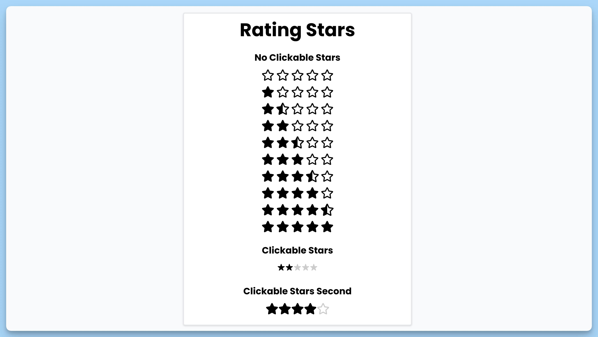

## 📦 Приложение - Рейтинг

### 🚀 Обзор
Данный код представляет собой главный компонент React-приложения под названием "Rating Stars". Компонент отображает три различных виджета с рейтингом звёзд, каждый из которых имеет свою функциональность:

1. "No Clickable Stars" - Отображает неинтерактивные звёзды, которые нельзя оценивать (рейтинг задан заранее).

2. "Clickable Stars" - Позволяет пользователю кликать на звёзды для установки оценки.

3. "Clickable Stars Second" - Предоставляет ещё один интерфейс для оценки звёздами, аналогичный предыдущему, но с другим стилем.

Компонент использует состояния и обработчики событий для отслеживания и установки рейтинга звёзд. Все виджеты отображаются на странице внутри главного контейнера.

---
#### 🌄 Превью:

-----
#### 🙌 Автор: [@nagoev-alim](https://github.com/nagoev-alim)

