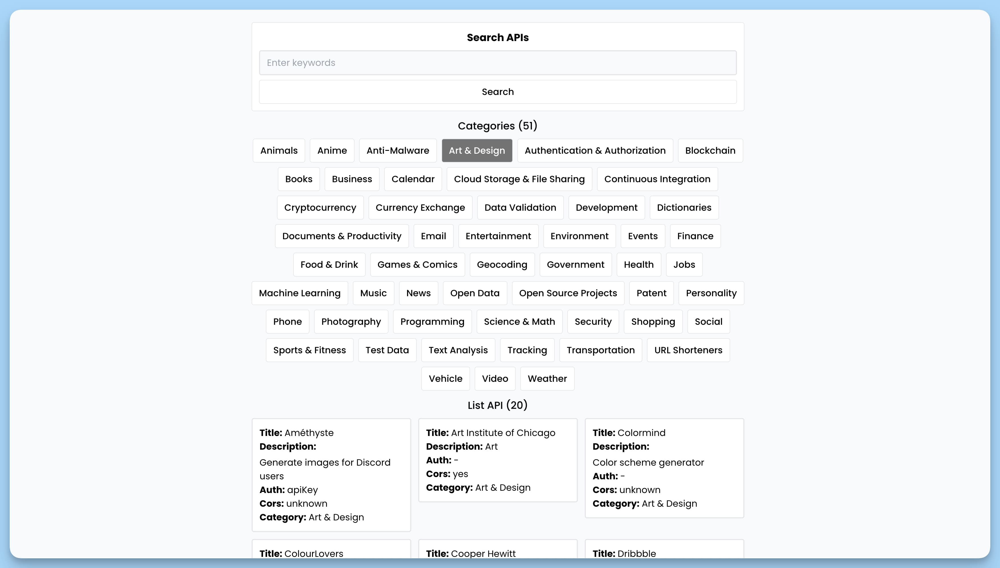

## 📦 Приложение - Поиск API

### 🚀 Обзор

Код представляет собой главный компонент приложения "`Search API`". Он использует несколько дочерних компонентов, таких как `Form`, `Categories` и `List`, для создания интерфейса поиска и отображения данных API. Компонент также использует библиотеку "`react-hot-toast`" для отображения уведомлений в нижней части экрана.

### Структура

- Компонент "`Form`" позволяет пользователю ввести ключевые слова для поиска API.
- Компонент "`Categories`" отображает доступные категории API и позволяет выбрать категорию для поиска.
- Компонент "`List`" отображает список API, соответствующих запросу, и предоставляет информацию о каждом API.
- Компонент "`Toaster`" используется для вывода уведомлений о действиях пользователя в нижней части экрана.

Компонент "App" объединяет все эти части в единое приложение для поиска и отображения информации об API.

---
#### 🌄 Превью:

-----
#### 🙌 Автор: [@nagoev-alim](https://github.com/nagoev-alim)

