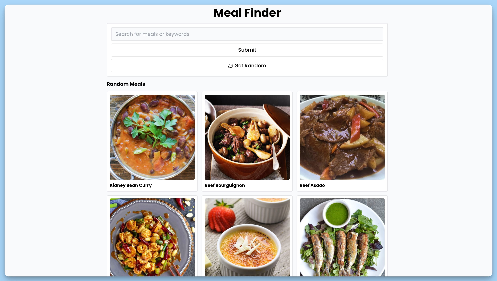
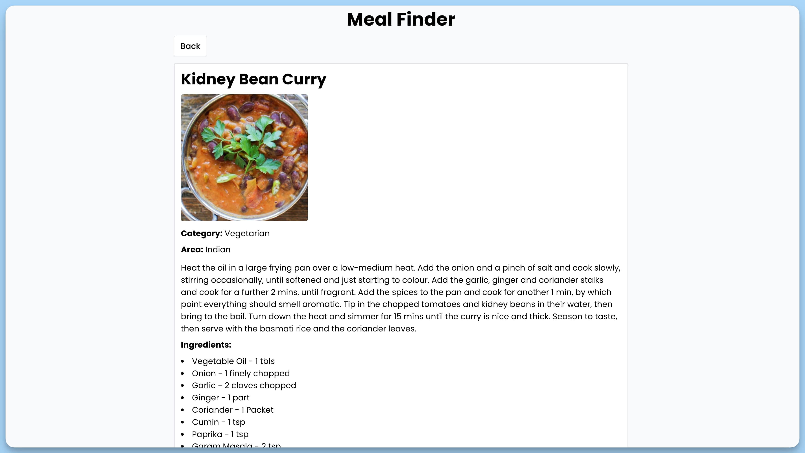

## 📦 Приложение - Поиск рецептов

### 🚀 Обзор

Данный код представляет собой главный React-компонент приложения "Meal Finder", который использует
библиотеку `react-hot-toast` для отображения уведомлений. Он также использует `react-router-dom` для маршрутизации
и `Suspense` для ленивой загрузки маршрутов.

### Детали

1. Заголовок приложения "Meal Finder" отображается в центре страницы.

2. Используется `BrowserRouter` из `react-router-dom` для настройки маршрутизации приложения.

3. Применяется `Suspense` с запасным элементом `
Loading...
`, чтобы обеспечить ленивую загрузку маршрутов и
   отображения загрузочного состояния во время загрузки.

4. `AppRoutes` компонент, который предположительно содержит определение маршрутов, загружается внутри `Suspense`.

5. Используется `Toaster` из `react-hot-toast` с позицией 'bottom-center' для отображения уведомлений в нижней части
   экрана.

Компонент `App` является главной точкой входа в приложение и определяет его структуру и маршрутизацию.

### Компонент `Home`

Данный код представляет собой React-компонент главной страницы "Home" приложения. Он позволяет пользователю искать
случайные блюда и осуществлять поиск по ключевым словам. Компонент также предоставляет возможность просматривать
детальную информацию о найденных блюдах.

### Детали

1. **`randomItems`** и **`searchItems`** - это состояния, которые хранят информацию о случайных блюдах и результатах
   поиска соответственно.

2. **`query`** - состояние, которое хранит текущий поисковый запрос.

3. **`isLoading`** и **`isSearchLoading`** - состояния, которые отслеживают состояния загрузки данных случайных блюд и
   результатов поиска.

4. **`useEffect`** выполняется при загрузке компонента и загружает случайные блюда, если они ещё не были загружены.

5. **`getRandomMeals`** - асинхронная функция для получения случайных блюд. Она обновляет состояние `randomItems` с
   новыми данными о блюдах и сохраняет их в локальном хранилище.

6. **`handleSubmit`** - асинхронная функция для обработки отправки формы поиска. Она выполняет запрос к API с ключевыми
   словами и обновляет состояние `searchItems` с результатами поиска.

7. Визуально, компонент отображает форму поиска, кнопку для обновления случайных блюд и результаты поиска. Во время
   загрузки, отображаются индикаторы загрузки.

8. При клике на найденное блюдо, пользователь перенаправляется на детальную страницу блюда.

9. В случае ошибки, отображается уведомление об ошибке с возможностью просмотра дополнительных деталей в консоли.

Компонент "Home" предоставляет важный функционал для поиска и просмотра информации о блюдах и управления ими.

### Компонент `Single`

## Краткое описание

Данный код представляет собой React-компонент "Single", который отвечает за отображение информации о конкретном блюде.
Он получает данные о блюде из API на основе идентификатора блюда, который извлекается из URL. Компонент также
предоставляет возможность вернуться на главную страницу.

### Детали

1. **`mealId`** - идентификатор блюда, полученный из URL.

2. **`data`** - состояние, которое хранит информацию о конкретном блюде.

3. **`isLoading`** - состояние, которое отслеживает состояние загрузки данных о блюде.

4. **`useEffect`** выполняется при монтировании компонента для загрузки данных о блюде. Он выполняет запрос к API,
   обрабатывает полученные данные и обновляет состояние `data`. В случае ошибки, уведомление об ошибке выводится и
   информация об ошибке записывается в консоль.

5. Визуально, компонент отображает информацию о блюде, включая его название, изображение, категорию, происхождение,
   инструкции по приготовлению и список ингредиентов. Во время загрузки, отображается индикатор загрузки.

6. Компонент также предоставляет ссылку "Back", которая перенаправляет пользователя на главную страницу приложения.

7. В случае успешной загрузки данных о блюде, информация отображается на странице.

8. В случае ошибки, пользователь видит уведомление об ошибке с возможностью просмотра дополнительных деталей об ошибке в
   консоли.

Компонент "Single" обеспечивает отображение и управление информацией о конкретном блюде и предоставляет функциональность
для возвращения на главную страницу.

---

#### 🌄 Превью:

-----

#### 🙌 Автор: [@nagoev-alim](https://github.com/nagoev-alim)

