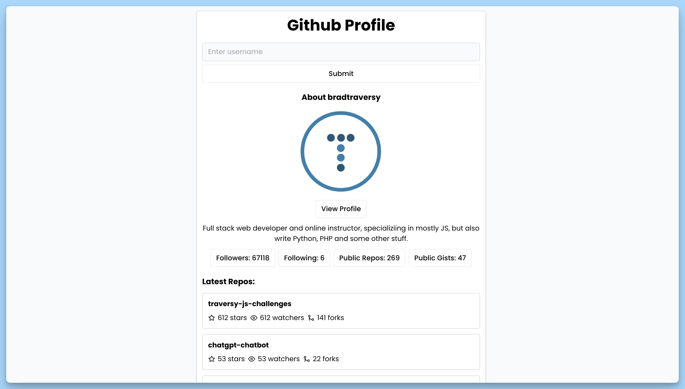

## 📦 Приложение - Информация о профиле GitHub

### 🚀 Обзор
Этот код представляет собой React-приложение для поиска и отображения профилей пользователей на GitHub, а также их репозиториев. Вот краткое описание:

- Компонент `App` представляет собой главный компонент приложения.
- Пользователь вводит имя пользователя GitHub в поле ввода и отправляет форму для поиска.
- После отправки формы, приложение отправляет запросы к GitHub API для получения информации о пользователе и его репозиториях.
- Если пользователь не найден или поле ввода оставлено пустым, выводится сообщение об ошибке.
- Пока выполняется поиск, отображается индикатор загрузки.
- Если пользователь найден, отображается его информация, включая имя, аватар, ссылку на профиль, биографию, количество подписчиков и подписок, количество открытых репозиториев и гистов.
- Также выводится список последних репозиториев пользователя с информацией о количестве звёзд, наблюдателей и форков.
- Используется библиотека `react-hot-toast` для отображения уведомлений, таких как сообщения об ошибках.
- Используются различные иконки из библиотеки `react-icons`.
- Интерфейс `User` представляет информацию о пользователе, а `Repos` - информацию о репозиториях.
- Для управления состоянием приложения используются React хуки `useState`.

Комментарии и JSDoc теги в коде предоставляют информацию о типах и описаниях для переменных и функций, что помогает разработчикам легче понимать код и его назначение.

---
#### 🌄 Превью:

-----
#### 🙌 Автор: [@nagoev-alim](https://github.com/nagoev-alim)

