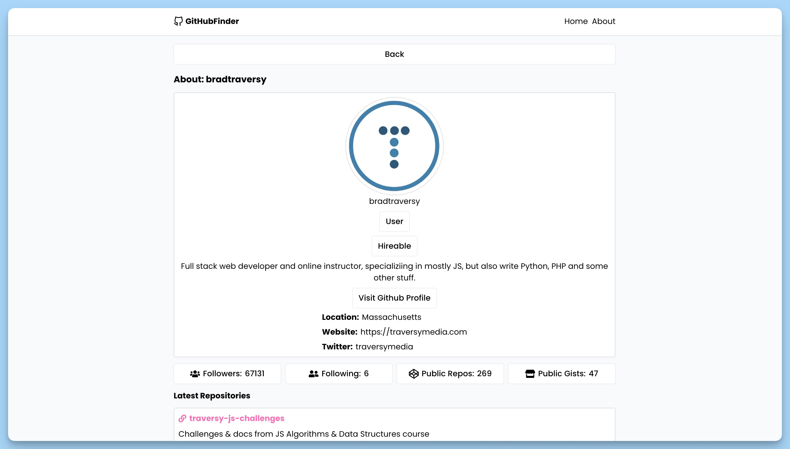

## 📦 Приложение - Поиск профиля GitHub

### 🚀 Обзор

Данный код представляет React-компонент приложения "GitHub Finder". Он выполняет следующие действия:

1. Импортирует необходимые зависимости, включая библиотеку `react-hot-toast` для уведомлений, `react` для работы с React, `react-router-dom` для маршрутизации, компонент `AppRoutes` для маршрутов приложения и компонент `Header`.

2. Определяет функциональный компонент `App`, который представляет главный компонент приложения.

3. Возвращает JSX-элемент, который содержит следующие части:
  - Оболочку для маршрутизации, обеспечивая использование React Router (`<BrowserRouter>`).
  - Верхний компонент `Header`, отображающий заголовок приложения.
  - Использует компонент `Suspense` с отображением заглушки (сообщение "Loading...") в ожидании загрузки маршрутов при помощи компонента `AppRoutes`.
  - Отображает компонент `Toaster` для вывода уведомлений в нижней части экрана, используя библиотеку `react-hot-toast`.

Этот компонент является главным контейнером приложения, объединяющим различные компоненты и обеспечивающим маршрутизацию между разными частями при

### Компонент `Home`

Данный код представляет React-компонент главной страницы приложения "GitHub Finder". Этот компонент выполняет следующие действия:

1. Импортирует необходимые зависимости, включая библиотеки для работы с React, роутингом, уведомлениями и другие компоненты приложения.

2. Определяет функциональный компонент `Home`, который представляет главную страницу приложения и позволяет пользователям искать пользователей GitHub.

3. Возвращает JSX-элемент, который содержит следующие части:
  - Форму для поиска пользователей с текстовым полем и кнопкой "Search". При отправке формы вызывается функция `handleSubmit`, которая обрабатывает поиск пользователей.
  - Если при отправке формы поле поиска пустое, отображается уведомление об ошибке с помощью библиотеки `react-hot-toast`.
  - Во время выполнения поиска отображается индикатор загрузки `Loader`.
  - Если происходит ошибка при поиске, отображается компонент `Error`.
  - Если результат поиска не пустой, отображается список пользователей с их аватарами, именами и кнопкой "View Detail" для перехода к деталям профиля.

4. Добавлены стили и классы для стилизации компонента и его элементов.

Этот компонент представляет интерфейс для поиска и отображения пользователей GitHub и является частью приложения "GitHub Finder

### Компонент `Single`

Данный код представляет React-компонент страницы "Single", которая отображает информацию о пользователе GitHub и его репозиториях. Компонент выполняет следующие действия:

1. Импортирует необходимые зависимости, включая роутинг, контекст приложения, уведомления и компоненты для загрузки и отображения ошибок.

2. Определяет функциональный компонент `Single`, который представляет страницу с информацией о пользователе.

3. Внутри компонента `Single`:
  - Извлекает параметры из URL, включая имя пользователя (username) с помощью `useParams` из `react-router-dom`.
  - Использует контекст приложения, чтобы получить информацию о пользователе и его репозиториях.
  - При помощи `useEffect` выполняет запрос к API GitHub для получения данных о пользователе и его репозиториях.
  - Отображает кнопку "Back" для возврата на предыдущую страницу с помощью `useNavigate`.
  - Если данные загружаются, отображает индикатор загрузки `Loader`.
  - Если при загрузке данных возникает ошибка, отображает компонент `Error`.
  - Если данные успешно получены, отображает информацию о пользователе, включая его аватар, имя, логин, тип аккаунта и дополнительные сведения.
  - Выводит информацию о местоположении, веб-сайте и Twitter (если они указаны).
  - Отображает список репозиториев пользователя с их описанием и статистикой (звезды, наблюдатели и другие).

4. Добавлены стили и классы для стилизации компонента и его элементов.

Этот компонент позволяет пользователю просматривать подробности о пользователе GitHub и его репозиториях и является частью приложения "GitHub Finder

### Компонент `About`

Данный код представляет React-компонент `About`, который представляет страницу "О приложении". Компонент выполняет следующие действия:

1. Определяет функциональный компонент `About`, который представляет страницу с информацией о приложении.

2. Внутри компонента `About`:
  - Создает контейнер с определенными стилями для размещения контента страницы.
  - Выводит заголовок "About" с использованием элемента `<h1>`.
  - Предоставляет описание приложения в виде текста, описывающего его назначение, в данном случае, это "A React app to search GitHub profiles and see profile details."
  - Указывает версию приложения и имя автора, используя теги `
` и информацию о версии и авторе.
  - Все элементы размещены внутри контейнера с определенными стилями, включая отступы и границу.

3. Добавлены стили и классы для стилизации компонента и его элементов.

Этот компонент представляет информацию о приложении "GitHub Finder" и является частью при

---
#### 🌄 Превью:

-----
#### 🙌 Автор: [@nagoev-alim](https://github.com/nagoev-alim)

